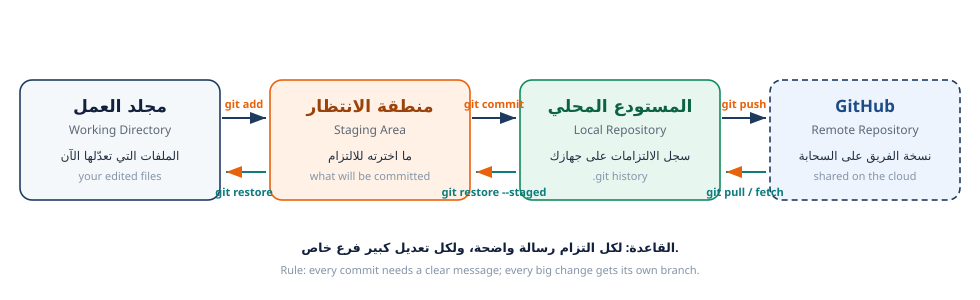

---
{
  "badge_n": "00",
  "badge_l": "دليل البرنامج",
  "kicker": "ورشة Git وGitHub — البرنامج التدريبي العملي",
  "title": "دليل البرنامج والمشروع",
  "en_title": "Programme & Project Handbook — class-team-hub",
  "meta": [
    ["عدد الجلسات / Sessions", "5 جلسات + وحدة متقدمة 06"],
    ["المدة الكلية / Total time", "7.5 ساعة تدريب موجّه"],
    ["المشروع / Project", "class-team-hub — موقع فريق الصف"],
    ["المخرجات / Deliverables", "6 أوراق عمل + عروض الجلسات + موقع منشور"],
    ["الدرجة الكلية / Total points", "500 نقطة (+100 للوحدة المتقدمة)"],
    ["المتطلبات / Requirements", "حاسوب + إنترنت + حساب GitHub"]
  ],
  "footer": "ورشة Git وGitHub · دليل البرنامج والمشروع",
  "en_footer": "Git & GitHub Workshop · Programme handbook"
}
---

:::band{ar="ماذا سنبني معاً؟" en="What are we building together?"}
:::

<figure class="dia"><figcaption>مشروع واحد · فريق واحد · تاريخ واحد — يديره Git / one repository, one team, one history</figcaption></figure>

:::bi
سنبني معاً **موقعاً حقيقياً على الإنترنت** اسمه «دليل فريق الصف» (`class-team-hub`).
كل طالب سيضيف بطاقة تعريفية له بنفسه، وسنرى البطاقات تتراكم واحداً بعد آخر حتى يصبح
الموقع — الذي بدأ فارغاً — لوحةً كاملة لفريق الصف، منشورة على رابط عام يفتحه أي شخص.
المشروع مكتوب بلغات الويب الأساسية (HTML وCSS وJavaScript) ولا يحتاج تثبيت أي برامج
أو بيئات تطوير معقّدة.
---EN---
Together we build a real website — “Class Team Hub” — where every student adds their own
profile card, and we watch the cards accumulate until the empty site becomes a complete team
board, published publicly on the internet.
:::

## فكرة المشروع في سطر واحد

| السؤال | الجواب |
|---|---|
| ما هو المشروع؟ | موقع ويب بسيط يعرض بطاقة تعريفية لكل طالب في الفريق |
| ما نوعه تقنياً؟ | موقع ثابت: HTML + CSS + JavaScript + ملفات بيانات JSON |
| كيف يعمل؟ | `js/app.js` يقرأ بطاقات الطلبة من `data/members/` ويبني الصفحة منها |
| لماذا مناسب لتعلم Git؟ | لأن كل طالب يضيف ملفاً خاصاً به (لا تعارض) والملف المشترك الوحيد مُولَّد آلياً — فيتعلّم الفريق الدمج بلا فوضى ثم يتدرب على التعارض بوعي |
| ما المطلوب تثبيته؟ | Git + VS Code فقط (والمتصفح موجود) |
| ماذا سنتعلّم منه؟ | الفروع · الالتزامات · طلبات السحب · المراجعة · الدمج · التعارضات · النشر |

:::box{type="tip" ar="لماذا اخترنا موقعاً بلا تبعيات؟" en="Why a zero-dependency site?"}
لأن أهم ما قد يعطّل ورشة Git هو **مشاكل تثبيت بيئات التشغيل** (`npm install`، إصدارات
Node، حزم مفقودة). اخترنا موقعاً ثابتاً ليكون تركيز الجلسات كلها على Git وGitHub —
وليس على إصلاح بيئة التطوير. هذا يكسبك 40% من وقت الورشة.
:::

:::band{type="alt" ar="خريطة البرنامج" en="Programme map"}
:::

<figure class="dia"><figcaption>من جهازك إلى GitHub: add → commit → push → pull — the daily cycle</figcaption></figure>

| الورقة | موضوعها | ماذا ستفعل فيها؟ | مخرجاتها |
|---|---|---|---|
| **01** | التهيئة والتعريف | تثبيت Git، حساب GitHub، مفتاح SSH أو PAT، أول مستودع شخصي | بيئة عمل جاهزة ومؤمَّنة |
| **02** | الاستنساخ والاستكشاف | نسخ مستودع الفريق، قراءة بنيته، تشغيل الموقع محلياً | الموقع يعمل على جهازك |
| **03** | الفرع وطلب السحب | إنشاء فرع، كتابة بطاقتك، الالتزام، الرفع، فتح طلب سحب، مراجعة زميل | بطاقتك + مراجعة مكتوبة |
| **04** | المزامنة والدمج | جلب تعديلات الزملاء، استراتيجيات الدمج، فحص التاريخ، التراجع الآمن | فهم كامل لـ merge + تقرير الفريق |
| **05** | التعارضات والنشر | صنع تعارض عن قصد وحلّه، rebase والدفع الآمن، النشر على GitHub Pages | موقع منشور + تسليم نهائي |
| **06** | الأتمتة وحماية الجودة *(وحدة متقدمة اختيارية)* | سير عمل GitHub Actions، حماية الفرع وCODEOWNERS، الإصدارات والوسوم | فحص أخضر + إصدار v1.0.0 |

:::band{ar="قواعد العمل في الفريق" en="Team ground rules"}
:::

:::box{type="rule" ar="دستور الفريق المختصر — يُعلَّق على الحائط" en="The short team constitution"}
1. **لا عمل مباشر على `main` أبداً.** كل تعديل عبر فرع، ثم طلب سحب، ثم مراجعة، ثم دمج.
2. **مزامنة قبل العمل:** `git switch main && git pull --ff-only` قبل إنشاء أي فرع جديد.
3. **فرع واحد = مهمة واحدة.** اسم الفرع: `type/username-topic` (بالإنجليزية والحروف الصغيرة).
4. **رسالة التزام ذات معنى:** `type(scope): وصف قصير` — لا `update` ولا `changes`.
5. **لا دمج بلا مراجعة** — ويكون للمراجع تعليق مكتوب محدد، لا «موافق».
6. **لا تعدّل ملف زميل ولا تحذف عمله.**
7. **لا أسرار في المستودع:** لا كلمات مرور، ولا رموز وصول، ولا بيانات شخصية حساسة.
8. **افحص قبل أن ترفع:** `node tests/validate-members.mjs` ثم `git diff --check`.

| القاعدة | الأمر الذي يفرضها | إن خالفتها |
|---|---|---|
| لا عمل على `main` | حماية الفرع على GitHub (Protected branch) | الدفع يُرفض تلقائياً |
| رسالة التزام واضحة | `git commit -m "…"` والمراجعة البشرية | خصم في تقييم الورقة |
| بيانات سليمة | `node tests/validate-members.mjs` | فشل الفحص = إعادة العمل |
| لا أسرار | `.gitignore` + الفحص اليدوي | خصم أمني مباشر |
| مراجعة قبل الدمج | إعداد `Require pull request before merging` | لا يُدمج الطلب |

:::band{type="violet" ar="أدوار الفريق (وزّعها في الجلسة الأولى)" en="Team roles"}
:::

| الدور | المسؤولية | من يستفيد منه؟ |
|---|---|---|
| **قائد الفريق** (1–2 لكل صف) | يدير الترتيب، يوافق على الدمج، يحلّ الخلافات التقنية | الطالب الأسرع — ليتعلّم القيادة لا الأداء فقط |
| **مطوّر** | يضيف ميزة (تحسين البحث، فلترة بالوسوم، بطاقات أنيقة) | من يميل للكود |
| **مصمّم** | يحسّن الألوان والتخطيط بملف `css/style.css` | من يحب الواجهات |
| **مختبر QA** | يشغّل `validate-members` ويتحقق من ظهور البطاقات والصفحة | من يميل للتفاصيل والنقد |
| **كاتب توثيق** | يحدّث `README.md` و`docs/` وأدلة الاستخدام | من يجيد الشرح بالكتابة |
| **مراجع (Reviewer)** | يقرأ طلبات السحب ويكتب ملاحظات محددة | **الجميع** — ولو مرة واحدة على الأقل |

:::box{type="warn" ar="توزيع الأدوار ليس «تقسيم عمل» فقط" en="Roles are not just division of labour"}
اجعل كل طالب يجرّب **دورين مختلفين** خلال البرنامج (مثل: مصمّم ثم مراجع، مختبر ثم كاتب)
حتى لا يُحصر في تخصص واحد. المهارة المستهدفة هي الفهم الكامل لدورة العمل، لا الإتقان
في زاوية واحدة منها.
:::

:::band{type="green" ar="ما ستُقيَّم عليه" en="How you will be assessed"}
:::

| المكوّن | الوزن | تفصيله |
|---|---|---|
| المخرجات العملية (أدلة الأوامر) | 40% | مخرجات حقيقية من جهازك لكل مهمة، لا نسخاً من الورقة |
| بطاقتك مدموجة ومراجعة زميل | 20% | وجود بطاقتك على `main` مع مراجعة مكتوبة وموثقة |
| حل التعارضات والنشر | 20% | دليل حل تعارضين + رابط الموقع المنشور يعمل |
| الفهم (أسئلة التحقق وتقرير الفريق) | 15% | إجابات بفهمك، وتقرير بأرقام حقيقية من المستودع |
| الأتمتة (اختياري — ورقة 06) | 100 نقطة إضافية | فحص أخضر، حالة فاشلة موثّقة، إصدار مرقّم |
| التعاون والاحتراف | 5% | الالتزام بالاتفاقيات، جودة المراجعة، أمان بيانات الفريق |

## ماذا تحتاج تجهّزه قبل الجلسة الأولى؟

:::check{ar="قائمة التحضير الشخصي" en="Your preparation checklist"}
- [ ] حاسوب تستطيع تثبيت البرامج عليه (لا يعمل هذا البرنامج على الجهاز اللوحي فقط)
- [ ] اتصال إنترنت مستقر في القاعة
- [ ] بريد إلكتروني فعّال (ستحتاجه لتأكيد حساب GitHub)
- [ ] مساحة 2 جيجابايت فارغة على القرص للتثبيت والمشاريع
- [ ] دفتر ملاحظات صغير — ستدوّن فيه «كل أمر جديد تعلمته وماذا يفعل»
- [ ] هذا الدليل + أوراق العمل الخمس
:::

:::box{type="info" ar="مسار مقترح لمن يريد التقدّم" en="Optional advanced path"}
1. **إضافة ميزة للموقع**: بحث بالوسوم (`tags`) أو ترتيب البطاقات أو وضع ليلي — عبر فرع وطلب سحب.
2. **التحقق التلقائي (CI)**: موجود أصلاً في المشروع (`.github/workflows/validate.yml`) —
   ادرسه في الورقة 06، وأضف إليه فحصاً جديداً لخطأ يتكرر في فريقك.
3. **المساهمة في مشروع مفتوح**: مستودع `first-contributions` أو ترجمة توثيق مشروع تحبه —
   بنفس الدورة التي أتقنتها: fork ← فرع ← التزام ← طلب سحب.
:::

:::badge{ar="أهلاً بك في الفريق — لنبدأ من الورقة 01" type="navy"}
:::
