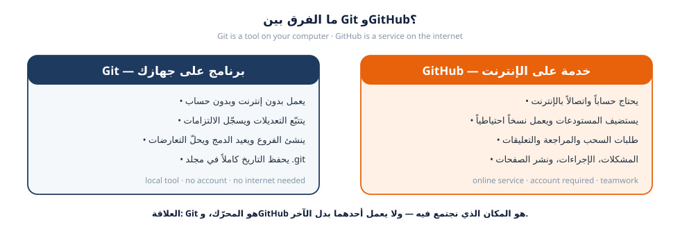

---
{
  "badge_n": "01",
  "badge_l": "ورقة عمل",
  "kicker": "ورشة Git وGitHub — البرنامج التدريبي العملي",
  "title": "التهيئة والتعريف بـ Git وGitHub",
  "en_title": "Workshop 1 · Setup & Orientation — Git vs. GitHub",
  "meta": [
    ["المدة / Duration", "90 دقيقة"],
    ["المستوى / Level", "مبتدئ — لا يشترط خبرة سابقة"],
    ["المتطلبات / Prerequisites", "جهاز حاسوب + اتصال إنترنت"],
    ["المخرجات / Deliverable", "حساب GitHub + Git مثبّت ومُعدّ"],
    ["المهام / Tasks", "6 مهام"],
    ["الدرجة / Points", "100 نقطة"]
  ],
  "footer": "ورشة Git وGitHub · ورقة عمل 01 — التهيئة والتعريف",
  "en_footer": "Git & GitHub Workshop · Worksheet 01 — Setup & Orientation"
}
---

:::band{ar="كيف تعمل هذه الورقة؟" en="How this worksheet works"}
:::

:::bi
هذه الورقة **عملية بالكامل**: لا تُقرأ فقط، بل تُنفَّذ خطوة بخطوة على جهازك. كل مهمة
تحتوي على: هدف واضح، أوامر جاهزة للنسخ، ومكاناً مخصّصاً تلصق فيه مخرجات الأوامر
(نسمّيها **الأدلة**)، ثم قائمة فحص قبل التسليم. عند إكمال كل المهام ستملك حساباً
جاهزاً على GitHub ومستودعاً يعمل على جهازك — وهما أساس كل الجلسات التالية.
---EN---
This worksheet is **hands-on**: you do every step on your own machine. Each task gives you
a clear objective, copy-ready commands, and a space to paste your command output as
**evidence**, followed by a checklist. By the end you will have a working GitHub account and
a local repository — the foundation for every later session.
:::

:::goal{ar="أهداف التعلّم" en="Learning objectives"}
- التمييز بوضوح بين **Git** (أداة على جهازك) و**GitHub** (خدمة على الإنترنت).
- تثبيت Git والتحقق من نجاح التثبيت وضبط الهوية (الاسم والبريد) بشكل صحيح.
- إنشاء حساب GitHub مهني وتأمينه بالتحقق بخطوتين ومفتاح SSH أو رمز وصول.
- فهم المناطق الثلاث: مجلد العمل ← منطقة الانتظار ← المستودع، وعلاقتها بـ GitHub.
- إنشاء أول مستودع شخصي وتنفيذ أول `commit` وأول `push` بنجاح.
- قراءة حالة المستودع بالأوامر `git status` و`git log` وربطها بالواجهة الرسومية.
:::

:::box{type="tip" ar="قاعدتان قبل أن نبدأ" en="Two ground rules"}
1. **اكتب الأوامر بيدك، لا تنسخها فقط.** الخطأ في الأمر وإصلاحه هو أسرع طريقة للتعلّم.
2. **لا تخف من الخطأ.** كل مستودع محلي نسخة مستقلة، وأي تجربة خاطئة يمكن التراجع عنها
   لاحقاً بأمر واحد — وستتعلّم هذه الأوامر في ورقة العمل 04.
:::

:::band{type="alt" ar="الجزء الأول · المفاهيم الأساسية" en="Part 1 · Core concepts"}
:::

## ما هو Git؟ وما هو GitHub؟

:::bi
**Git** برنامج مجاني مفتوح المصدر يعمل على جهازك، يتتبّع كل تعديل تجريه على ملفات
المشروع، ويحفظ التاريخ بشكل نقاط تحقّق (Commits) يمكن الرجوع إليها في أي وقت.
أما **GitHub** فهو موقع إلكتروني يستضيف مستودعات Git على الإنترنت، ويضيف فوقها طبقة
تعاون: طلبات السحب (Pull Requests)، المراجعة (Review)، المشكلات (Issues)، والصلاحيات.
---EN---
**Git** is a free, open-source tool that runs on your computer. It tracks every change you
make and stores history as checkpoints called commits. **GitHub** is a website that hosts Git
repositories online and adds a collaboration layer on top: pull requests, code review,
issues, and permissions.
:::

<figure class="dia"><figcaption>شكل 1: Git أداة محلية، وGitHub خدمة سحابية للتعاون <span class="en">— local tool vs. online service</span></figcaption></figure>

:::bi
دليل سريع: إذا كان الأمر يبدأ بـ `git` فهو يعمل على جهازك؛ وإذا كان يتطلب فتح الموقع
أو يتضمن كلمة `origin` فهو يتعامل مع GitHub. وبدون Git مثبّتاً على جهازك لن تستطيع
التعامل مع GitHub من سطر الأوامر إطلاقاً.
---EN---
Quick test: a command that starts with `git` works on your machine; anything that needs the
website or mentions `origin` talks to GitHub. Without Git installed locally you cannot work
with GitHub from the command line at all.
:::

## المناطق الثلاث في Git

:::bi
كل ملف تمرّ عليه ينتقل بين ثلاث مناطق. فهم هذه الصورة يوفّر عليك ساعات من الحيرة لاحقاً،
لأن 90% من رسائل Git الغامضة تعني ببساطة: «هذا الملف في منطقة، وأنت تحاول تنفيذ أمر
يخصّ منطقة أخرى».
---EN---
Every file moves through three areas. Understanding this picture saves hours of confusion
later, because most cryptic Git messages simply mean: “this file is in one area, and you are
running a command that belongs to another.”
:::

<figure class="dia"><figcaption>شكل 2: من مجلد العمل إلى GitHub عبر منطقة الانتظار <span class="en">— working directory → staging → local repo → remote</span></figcaption></figure>

| الأمر / Command | المنطقة التي يعمل عليها | التشبيه العملي |
|---|---|---|
| `git status` | لا يعدّل شيئاً — يعرض الحالة | لوحة القيادة |
| `git add` | ينقل من مجلد العمل إلى منطقة الانتظار | تحضير الطلب |
| `git commit` | يحفظ من منطقة الانتظار إلى المستودع المحلي | تسليم الطلب |
| `git push` | يرفع من المستودع المحلي إلى GitHub | إرسال الطلب للفروع |
| `git pull` | يجلب من GitHub إلى جهازك | استلام تحديثات الزملاء |

:::box{type="warn" ar="انتباه" en="Watch out"}
`git push` وحده لا يرفع أي ملف لم تلتزمه بـ `git commit`، و`git commit` وحده لا يرفع
شيئاً إلى GitHub. الترتيب الإلزامي دائماً: `add` ← `commit` ← `push`.
:::

:::band{ar="مصطلحاتك الأولى" en="Your first glossary"}
:::

| المصطلح | النطق التقريبي | المعنى بالعربية | English gloss |
|---|---|---|---|
| Repository | ريپازِتوري | مستودع: مجلد مشروع يتتبّعه Git | A tracked project folder |
| Commit | كومِت | التزام: نقطة تحقّق محفوظة برسالة | A saved checkpoint with a message |
| Branch | برانش | فرع: مسار عمل مستقل عن `main` | An independent line of work |
| Main | مين | الفرع الرئيسي المستقر للمشروع | The stable primary branch |
| Remote | ريموت | مستودع بعيد على GitHub | A repository hosted online |
| Clone | كلون | نسخ المستودع كاملاً إلى جهازك | Copy a repo to your machine |
| Push / Pull | پوش / پُل | رفع تعديلاتك / جلب تعديلات الزملاء | Upload / download changes |
| Pull Request | پُل ريكوست | طلب سحب: اقتراح دمج فرعك بعد المراجعة | A merge proposal awaiting review |
| Merge | ميرج | دمج تعديلات فرع داخل فرع آخر | Combine branches |
| Conflict | كونفليكت | تعارض: تعديلان متضاربان على السطر نفسه | Competing edits on the same line |
| Staging | ستينچنغ | منطقة الانتظار قبل الالتزام | The pre-commit area |
| Issue | إيشو | مشكلة أو مهمة مسجّلة في المستودع | A tracked task or bug |

:::band{type="alt" ar="الجزء الثاني · المهام العملية" en="Part 2 · Hands-on tasks"}
:::

:::task{num="1" ar="تثبيت Git والتحقق منه" en="Install Git and verify it" time="15 دقيقة" level="مبتدئ" pts="10" tools="Windows|macOS|Linux|Terminal"}
**الهدف:** أن يتعرّف الجهاز على الأمر `git` ويُظهر رقم الإصدار.

**1) التثبيت حسب نظامك:**

| النظام | الطريقة الأسهل | ملاحظة مهمة |
|---|---|---|
| Windows | حمّل من [git-scm.com](https://git-scm.com/download/win) ثم التثبيت بالإعدادات الافتراضية | سيُضاف **Git Bash** — استخدمه بدل موجّه الأوامر |
| macOS | نفّذ `xcode-select --install` أو `brew install git` | الطرفية العادية تكفي |
| Linux (Debian/Ubuntu) | `sudo apt update && sudo apt install git` | الطرفية العادية تكفي |

**2) افتح الطرفية (Git Bash في Windows) وتحقق من التثبيت:**

:::term{title="Terminal — التحقق / verify"}
$ git --version
git version 2.39.5
:::

:::box{type="info" ar="ملاحظة" en="Note"}
رقم الإصدار عندك قد يختلف (2.4x أو أحدث) — المهم ألّا تظهر رسالة
`command not found` أو `'git' is not recognized`.
:::

**3) افحص مكان التثبيت (اختياري لكن مفيد عند حل المشكلات):**

:::term{title="Terminal — Windows / macOS / Linux"}
# Windows (Git Bash)
$ which git
/mingw64/bin/git

# macOS / Linux
$ which git
/usr/bin/git
:::

:::evidence{ar="دليل المطلوب لهذه المهمة" en="Evidence for this task"}
الصق مخرجات الأمر `git --version` كما ظهرت على جهازك:

```
$ git --version


```
اذكر نظام التشغيل الذي تستخدمه: ……………………………
:::

:::box{type="warn" ar="خطأ شائع" en="Common mistake"}
إذا رأيت `command not found` فأغلق النافذة وافتح واحدة جديدة بعد التثبيت، ثم أعد المحاولة.
في Windows تأكد أنك تستخدم **Git Bash** لا `cmd`.
:::

:::task{num="2" ar="ضبط هوية Git (الاسم والبريد)" en="Configure your Git identity" time="10 دقائق" level="مبتدئ" pts="10" tools="git config"}
**الهدف:** أن تُوقّع كل التزاماتك باسمك وبريدك الصحيحين، لأن هذه البيانات تظهر للفريق
في سجل المشروع ولا يمكن تصحيحها لاحقاً بسهولة.

:::term{title="Terminal — الإعداد لمرة واحدة"}
$ git config --global user.name "سارة الحسن"
$ git config --global user.email "sara@example.com"
$ git config --global init.defaultBranch main
$ git config --global pull.rebase true
$ git config --global core.editor "code --wait"
:::

:::box{type="err" ar="تحذير مهم جداً" en="Critical"}
استخدم **نفس البريد المسجَّل في حساب GitHub**؛ فإن اختلف البريد فلن يرتبط التزامك
بحسابك على GitHub، وقد يظهر باسم غريب بلا صورة ولا إحصاءات.
:::

**تحقّق من الإعدادات ثم اختبر قراءتها:**

:::term{title="Terminal — التحقق من الإعدادات"}
$ git config --list
user.name=سارة الحسن
user.email=sara@example.com
init.defaultbranch=main
pull.rebase=true
core.editor=code --wait

$ git config user.name
سارة الحسن
:::

:::evidence{ar="دليل المطلوب" en="Evidence"}
الصق مخرجات `git config --list`:

```
$ git config --list


```
:::

:::task{num="3" ar="إنشاء حساب GitHub مهني" en="Create a professional GitHub account" time="15 دقيقة" level="مبتدئ" pts="15" tools="المتصفح|Browser"}
**الهدف:** حساب جاهز للعمل الجماعي، باسم مستخدم واضح وتأمين جيد.

**الخطوات:**

1. افتح [github.com](https://github.com) واضغط **Sign up**.
2. أدخل البريد الإلكتروني (المدرسة أو الشخصي الموثوق) وكلمة مرور قوية
   (12 حرفاً على الأقل: حروف كبيرة وصغيرة وأرقام ورمز).
3. اختر **اسم المستخدم** بعناية — سيبقى معك في المشروع والمراجعات:

| ✔ اسم جيد | ✘ اسم ضعيف | السبب |
|---|---|---|
| `sara-alhassan` | `sara2009xxx` | أرقام عشوائية توحي بعدم الجدية |
| `omar-qa-dev` | `pro_gamer_99` | لا يوصف الدور المهني |
| `leen-haddad` | `asdfgh` | لا يُقرأ ولا يُتذكَّر |

4. أكمل التحقق من البريد واضغط الرابط في رسالة GitHub.
5. **فعّل التحقق بخطوتين (2FA):** الصورة الشخصية ← `Settings` ← `Password and authentication`
   ← `Two-factor authentication` ← `Enable` (استخدم تطبيق مصادقة مثل Microsoft Authenticator
   أو Google Authenticator). **احفظ رموز الاستعادة في مكان آمن** — بدونها قد تفقد حسابك.
6. حسّن ملفك الشخصي: صورة أو رمز واضح، اسم حقيقي، ووصف مختصر (مثال: `طالب هندسة —
   أتعلّم تطوير الويب`). هذه أول ما يراه المراجع في طلب سحبك.

:::box{type="tip" ar="لماذا 2FA إلزامية؟" en="Why 2FA is mandatory"}
من 2023 صار GitHub يفرض التحقق بخطوتين على من ينشر على مستودعات عامة. في هذه الورشة
كل الطلاب ينشرون على مستودع مشترك، لذا 2FA شرط تسليم لا اختيار.
:::

:::evidence{ar="دليل المطلوب" en="Evidence"}
- اسم المستخدم الذي اخترته: `………………………………`
- رابط ملفك الشخصي (مثال: `https://github.com/sara-alhassan`): ………………………………
- ضع علامة على ما أتممت: ☐ تأكيد البريد  ☐ تفعيل 2FA  ☐ صورة ووصف
:::

:::task{num="4" ar="تأمين الاتصال: مفتاح SSH أو رمز وصول" en="Secure your connection: SSH key or token" time="15 دقيقة" level="متوسط" pts="15" tools="ssh-keygen|GitHub"}
**الهدف:** تمكين الجهاز من الرفع إلى GitHub دون كتابة كلمة المرور كل مرة، وبأمان.

:::bi
**لماذا لا تكفي كلمة المرور؟** GitHub لم يعد يقبل كلمة مرور الحساب في أوامر git.
أمامك طريقان: **رمز الوصول الشخصي (PAT)** وهو أسهل، أو **مفتاح SSH** وهو الأفضل لجهازك
الشخصي لأنه لا ينتهي صلاحيته.
---EN---
**Why not the password?** GitHub no longer accepts account passwords for git commands. You
have two options: a **Personal Access Token (PAT)** — easiest — or an **SSH key**, which is
better on a personal machine because it does not expire.
:::

**الطريق أ — رمز الوصول الشخصي (الأسرع):**

:::term{title="GitHub — إنشاء PAT"}
1) Settings ← Developer settings ← Personal access tokens ← Tokens (classic)
2) Generate new token (classic)
3) Note: workshop-laptop     Expiration: 30 days
4) Scopes: اختر repo و read:user فقط   (أقل صلاحية ممكنة)
5) Generate token ← انسخ الرمز فوراً واحفظه في مدير كلمات المرور
:::

:::box{type="err" ar="تحذير أمني" en="Security warning"}
الرمز يظهر **مرة واحدة فقط**. لا تضعه في ملف داخل المستودع، ولا في محادثة، ولا في صورة
شاشة. عند طلب كلمة المرور في git، الصق الرمز بدل كلمة المرور.
:::

**الطريق ب — مفتاح SSH (الموصى به):**

:::term{title="Terminal — توليد مفتاح SSH وإضافة المفتاح العام"}
$ ssh-keygen -t ed25519 -C "sara@example.com"
Generating public/private ed25519 key pair.
Enter file in which to save the key (/home/sara/.ssh/id_ed25519):
Enter passphrase (empty for no passphrase):
Your identification has been saved in /home/sara/.ssh/id_ed25519
Your public key has been saved in /home/sara/.ssh/id_ed25519.pub

$ cat ~/.ssh/id_ed25519.pub
ssh-ed25519 AAAAC3NzaC1lZDI1NTE5AAAAI... sara@example.com

$ ssh -T git@github.com
Hi sara-alhassan! You've successfully authenticated, but GitHub does not provide shell access.
:::

انشر المفتاح: GitHub ← `Settings` ← `SSH and GPG keys` ← `New SSH key` ← الصق سطر
`ssh-ed25519 ...` كاملاً ← `Add SSH key`.

:::evidence{ar="دليل المطلوب" en="Evidence"}
- الطريق الذي اخترته: ☐ PAT  ☐ SSH
- الناتج المتوقع عند نجاح الاتصال (لـ SSH): `Hi <username>! You've successfully authenticated…`
- الصق هنا مخرجات `ssh -T git@github.com` أو تأكيد إنشاء PAT:

```
$ ssh -T git@github.com


```
:::

:::task{num="5" ar="تجهيز بيئة العمل: VS Code والطرفية" en="Set up your workspace: VS Code and the terminal" time="10 دقائق" level="مبتدئ" pts="10" tools="VS Code"}
**الهدف:** بيئة تحرير مريحة تُظهر لك حالة Git بلمحة بصر.

1. نزّل [Visual Studio Code](https://code.visualstudio.com) وثبّته.
2. من داخل VS Code افتح **Extensions** وثبّت (Arabic Language Pack اختياري):

| الإضافة | الفائدة |
|---|---|
| `Arabic Language Pack` | واجهة عربية إن رغبت |
| `GitLens` | يظهر لك من عدّل كل سطر ومتى (مهم في المراجعة) |
| `Prettier` | تنسيق تلقائي للملفات |
| `Live Server` | تشغيل ملف HTML مباشرة في المتصفح |

3. افتح الطرفية المدمجة: `Terminal ← New Terminal` (اختصار: `Ctrl+` `).
4. تحقّق أن الطرفية تعرف git وضبط اتجاه أوامرك:

:::term{title="VS Code Terminal"}
$ git --version
git version 2.39.5
$ git config user.name
سارة الحسن
:::

5. **جولة سريعة على أوامر الطرفية** التي ستستخدمها في كل جلسة:

| الأمر | الوظيفة | مثال |
|---|---|---|
| `pwd` | أين أنا الآن؟ | `/c/Users/sara/projects` |
| `ls` | ماذا يوجد هنا؟ | `ls -la` |
| `cd` | الانتقال إلى مجلد | `cd class-team-hub` |
| `cd ..` | الرجوع خطوة للخلف | |
| `mkdir` | إنشاء مجلد جديد | `mkdir projects` |
| `clear` | تنظيف الشاشة | |
| `history` | الأوامر السابقة | |

:::evidence{ar="دليل المطلوب" en="Evidence"}
الصق مخرجات `pwd` و`ls` من مجلد مشاريعك:

```
$ pwd


```
قائمة الإضافات التي ثبّتها: …………………………………………………………………………
:::

:::task{num="6" ar="أول مستودع شخصي: clone ثم commit ثم push" en="Your first repository: clone, commit, push" time="20 دقيقة" level="متوسط" pts="25" tools="git clone|git commit|git push"}

**الهدف:** تجربة الدورة الكاملة بنفسك على مستودع تجريبي شخصي (لم تُسلَّم بعد
المستودع المشترك — سيبدأ في ورقة العمل 02).

**الخطوة 1 — أنشئ مستودعاً فارغاً على GitHub:**

1. من أعلى الصفحة: **+** ← `New repository`.
2. الاسم: `git-practice-<اسم المستخدم>` — مثال: `git-practice-sara-alhassan`.
3. الوصف: `تديب شخصي على أوامر Git — ورشة الصف`.
4. النوع: **Public**، وفعّل `Add a README file`.
5. اضغط `Create repository`.

**الخطوة 2 — انسخ المستودع إلى جهازك (clone):**

:::term{title="Terminal — الاستنساخ"}
$ cd ~/projects
$ git clone https://github.com/sara-alhassan/git-practice-sara-alhassan.git
Cloning into 'git-practice-sara-alhassan'...
remote: Enumerating objects: 3, done.
remote: Counting objects: 100% (3/3), done.
Unpacking objects: 100% (3/3), done.

$ cd git-practice-sara-alhassan
$ ls
README.md
:::

:::box{type="info" ar="ماذا حدث؟" en="What just happened?"}
أمر `git clone` أنشأ مجلداً على جهازك يحتوي على كل ملفات المستودع + مجلد مخفي اسمه
`.git` فيه كامل التاريخ والإعدادات. لا تحذف أو تعدّل هذا المجلد يدوياً أبداً.
:::

**الخطوة 3 — عدّل ملف README.md** داخل VS Code: أضف سطرين عن نفسك.

**الخطوة 4 — افحص ثم التزم ثم ارفع:**

:::term{title="Terminal — الدورة الكاملة"}
$ git status
On branch main
Your branch is up to date with 'origin/main'.

Changes not staged for commit:
  (use "git add <file>..." to update what will be committed)
        modified:   README.md

$ git diff
diff --git a/README.md b/README.md
--- a/README.md
+++ b/README.md
@@ -1 +1,3 @@
 # git-practice-sara-alhassan
+طالبة في ورشة Git وGitHub.
+أتعلّم كيف يعمل الفريق على مشروع واحد.

$ git add README.md
$ git commit -m "docs(readme): add a short personal introduction"
[main 3f1a9c2] docs(readme): add a short personal introduction
 1 file changed, 2 insertions(+)

$ git push
Enumerating objects: 5, done.
To https://github.com/sara-alhassan/git-practice-sara-alhassan.git
   9d4b1a7..3f1a9c2  main -> main
:::

**الخطوة 5 — افحص التاريخ وتأكد أن التعديل ظهر على GitHub:**

:::term{title="Terminal — القراءة والتحقق"}
$ git log --oneline
3f1a9c2 (HEAD -> main, origin/main) docs(readme): add a short personal introduction
9d4b1a7 Initial commit

$ git remote -v
origin  https://github.com/sara-alhassan/git-practice-sara-alhassan.git (fetch)
origin  https://github.com/sara-alhassan/git-practice-sara-alhassan.git (push)
:::

:::evidence{ar="دليل المطلوب" en="Evidence"}
- رابط مستودعك: `https://github.com/……………………/……………………`
- الصق مخرجات `git log --oneline` (سطران على الأقل):

```
$ git log --oneline


```
- الصق مخرجات `git status` في اللحظة الأخيرة (يجب أن تكون نظيفة):

```
$ git status


```
:::

:::box{type="ok" ar="معيار الإتمام" en="Definition of done"}
تكون المهمة مكتملة عندما ترى على صفحة مستودعك في GitHub آخر التزام باسمك ورسالتك،
من دون أي رسالة خطأ في الطرفية.
:::

:::band{type="violet" ar="الجزء الثالث · تحقّق ومراجعة" en="Part 3 · Check your understanding"}
:::

## أسئلة تحقّق سريعة (15 نقطة)

**س1.** ما الفرق بين `git add` و`git commit`؟ اذكر ماذا يحدث في كل خطوة ولماذا نحتاجهما معاً.

:::write{n=3 label="إجابتك / Your answer"}
:::

**س2.** لو رفعت تعديلاً إلى GitHub ثم فتح زميلك المتصفح ولم يرَ أي تغيير، فما الاحتمالان الأكثر شيوعاً؟

:::write{n=3 label="إجابتك / Your answer"}
:::

**س3.** اكتب الأمر الذي يُظهر: (أ) حالة المشروع الحالية، (ب) آخر الالتزامات في سطر واحد لكل التزام.

:::write{n=2 label="إجابتك / Your answer"}
:::

**س4.** لماذا نستخدم اسم مستخدم مهنياً وصورة واضحة في GitHub؟ اذكر سببين مرتبطين بالعمل الجماعي.

:::write{n=3 label="إجابتك / Your answer"}
:::

**س5.** ما الذي يحدث إذا استخدمت بريداً مختلفاً في `git config user.email` عن بريد حسابك على GitHub؟

:::write{n=2 label="إجابتك / Your answer"}
:::

:::band{type="green" ar="قبل التسليم" en="Before you submit"}
:::

:::check{ar="قائمة الفحص النهائية" en="Final checklist"}
- [ ] نُفّذ `git --version` بنجاح وأظهر رقماً لا خطأ (المهمة 1)
- [ ] ضُبط `user.name` و`user.email` بنفس بريد GitHub (المهمة 2)
- [ ] الحساب مؤكَّد والتحقق بخطوتين مُفعَّل، والملف الشخصي مكتمل (المهمة 3)
- [ ] PAT أو مفتاح SSH يعمل واختُبر فعلاً (المهمة 4)
- [ ] VS Code مثبّت مع GitLens، والطرفية المدمجة تعمل (المهمة 5)
- [ ] مستودع شخصي أُنشئ ووُصل إليه بـ `clone` ورُفع إليه `commit` (المهمة 6)
- [ ] جميع الأدلة أعلاه مملوءة بمخرجات حقيقية لا منسوخة من الورقة
:::

:::scale{label="قيّم نفسك بصدق قبل التسليم / Rate yourself honestly"}
:::

:::evidence{ar="بطاقة التسليم" en="Submission card"}
| البند | ما يُسلَّم |
|---|---|
| رابط الحساب | `https://github.com/………………………` |
| رابط المستودع الشخصي | `https://github.com/………………………/………………………` |
| طريقة التعريف | ☐ PAT  ☐ SSH |
| اسم نظام التشغيل | ……………………… |
| الوقت الذي استغرقته فعلاً | ……………………… |
:::

:::box{type="info" ar="ما القادم؟" en="What's next"}
في **ورقة العمل 02** ستنسخ مستودع الفريق `class-team-hub`، وتفهم بنيته، وتشغّل موقع
الفريق على جهازك، وتجري تعديلك الأول على فرع خاص بك.
:::
