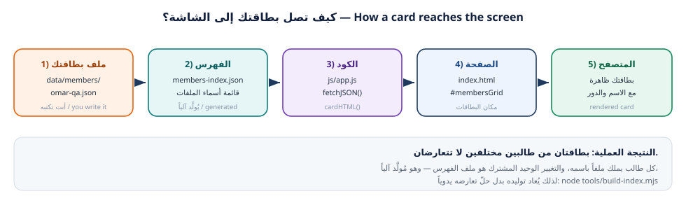

---
{
  "badge_n": "02",
  "badge_l": "ورقة عمل",
  "kicker": "ورشة Git وGitHub — البرنامج التدريبي العملي",
  "title": "استنساخ مستودع الفريق واستكشافه",
  "en_title": "Workshop 2 · Clone & Explore — Getting the Team Repository",
  "meta": [
    ["المدة / Duration", "75 دقيقة"],
    ["المستوى / Level", "مبتدئ — بعد إتمام ورقة 01"],
    ["المتطلبات / Prerequisites", "حساب GitHub فعّال + Git مثبّت"],
    ["المخرجات / Deliverable", "المستودع يعمل على جهازك"],
    ["المهام / Tasks", "5 مهام"],
    ["الدرجة / Points", "100 نقطة"]
  ],
  "footer": "ورشة Git وGitHub · ورقة عمل 02 — استنساخ المستودع واستكشافه",
  "en_footer": "Git & GitHub Workshop · Worksheet 02 — Clone & Explore"
}
---

:::band{ar="نظرة عامة على الورقة" en="Worksheet overview"}
:::

:::bi
سنتعرّف اليوم على **مشروع الفريق**: موقع ويب بسيط اسمه `class-team-hub` (دليل فريق الصف).
سيفتح كل طالب موقع الفريق على جهازه، ويقرأ بنية الملفات، ويفهم دورة البيانات من ملف
JSON إلى الصفحة المعروضة في المتصفح. وفي نهاية الورقة تشغّل الموقع بنفسك وتوثّق ذلك
بالأدلة.
---EN---
Today you meet the **team project**: a simple static website called `class-team-hub`.
Every student will open it on their machine, read its file structure, and understand the data
flow from a JSON card file to the rendered page. By the end you will run the site yourself and
document it with evidence.
:::

:::goal{ar="أهداف التعلّم" en="Learning objectives"}
- تنفيذ `git clone` وفهم ما يجلبه فعلاً إلى جهازك (الملفات + التاريخ + الإعدادات).
- التمييز بين المستودع البعيد `origin` والمستودعات المحلية، وقراءة ذلك من `git remote -v`.
- قراءة بنية مشروع حقيقي: HTML وCSS وJavaScript وبيانات JSON.
- تشغيل الموقع محلياً (فتح مباشر أو خادم محلي) وفهم الفرق بين الطريقتين.
- تتبّع ملف بطاقة واحد من `data/members/` إلى البطاقة المرسومة على الشاشة.
- استخدام `git log` و`git show` و`git diff` لفهم ما تغيّر ومَن غيّره.
:::

:::box{type="info" ar="القاعدة الذهبية" en="Golden rule"}
لا تعمل على `main` أبداً. كل تعديل — ولو كان سطراً واحداً — يبدأ من فرع (branch) خاص
بك. هذا يحمي عمل الفريق ويجعل مراجعة تعديلاتك سهلة. سنفصّل ذلك في ورقة العمل 03.
:::

:::band{type="alt" ar="الجزء الأول · الاستنساخ" en="Part 1 · Cloning"}
:::

## ما معنى «clone» بالتحديد؟

:::bi
أمر `git clone` لا ينسخ الملفات فقط، بل ينشئ نسخة كاملة من المستودع على جهازك: كل
الملفات، وكل الالتزامات في التاريخ، وكل الفروع، وكل إعدادات الربط بالخادم. وبعد
الاستنساخ يصبح لديك مستودع محلي مربوط بالمستودع البعيد باسم `origin`.
---EN---
`git clone` copies the whole repository — files, full commit history, all branches, and the
remote connection settings — into a local repository that knows its remote as `origin`.
:::

:::task{num="1" ar="جهّز مكان العمل ثم استنسخ مستودع الفريق" en="Prepare a workspace and clone the team repository" time="15 دقيقة" level="مبتدئ" pts="10" tools="git clone|git remote"}
**الهدف:** مجلد مشاريع منظّم + نسخة كاملة من مستودع الفريق على جهازك.

**الخطوة 1 — أنشئ مجلداً واحداً لكل مشاريعك (سنسمّيه `projects`):**

:::term{title="Terminal — تجهيز مكان العمل"}
$ cd ~
$ mkdir -p projects
$ cd projects
$ pwd
/home/sara/projects
:::

:::box{type="tip" ar="لماذا مجلد واحد؟" en="Why a single folder?"}
لأن الطرفية تعمل دائماً داخل «مجلد حالي». جمع المشاريع في `projects/` يجعل التنقّل
سهلاً، ويمنع أشهر خطأ للطلاب: تنفيذ أوامر Git داخل مجلد غير مستودع، فتظهر رسالة
`fatal: not a git repository`.
:::

**الخطوة 2 — استنسخ المشروع.** المدرب سلّمك رابط المستودع مسبقاً. مع `class-team-hub`
سيعمل كالتالي:

:::term{title="Terminal — الاستنساخ"}
$ git clone https://github.com/school-git-workshop/class-team-hub.git
Cloning into 'class-team-hub'...
remote: Enumerating objects: 87, done.
remote: Counting objects: 100% (87/87), done.
Unpacking objects: 100% (87/87), done.

$ cd class-team-hub
$ ls
CODE_OF_CONDUCT.md  CONTRIBUTING.md  LICENSE  README.md  assets  css  data
docs  index.html  js  sandbox  tests  tools
:::

:::box{type="warn" ar="إن استخدمت SSH" en="If you use SSH"}
استبدل الرابط بالصيغة: `git@github.com:school-git-workshop/class-team-hub.git`
ويفضّل أن يكون مفتاح SSH قد اختُبر في ورقة العمل 01.
:::

**الخطوة 3 — تأكد من الربط بالمستودع البعيد:**

:::term{title="Terminal — فحص المستودعات البعيدة"}
$ git remote -v
origin  https://github.com/school-git-workshop/class-team-hub.git (fetch)
origin  https://github.com/school-git-workshop/class-team-hub.git (push)

$ git status
On branch main
Your branch is up to date with 'origin/main'.

nothing to commit, working tree clean
:::

:::evidence{ar="دليل المطلوب" en="Evidence"}
- المسار الذي استنسخت إليه: `………………………………`
- الصق مخرجات `git remote -v`:

```
$ git remote -v


```
- الصق مخرجات `git status` الحالية:

```
$ git status


```
:::

:::task{num="2" ar="اقرأ بنية المشروع وافهم دور كل ملف" en="Read the project structure" time="15 دقيقة" level="مبتدئ" pts="20" tools="ls|tree|cat"}
**الهدف:** أن تصف لغة المشروع وملفاته وموضع بياناتك فيه.

**الخطوة 1 — اعرض الشجرة الكاملة:**

:::term{title="Terminal — عرض الملفات"}
$ ls -la
$ find . -type f -not -path "./.git/*" | sort
./.github/PULL_REQUEST_TEMPLATE.md
./.gitignore
./CODE_OF_CONDUCT.md
./CONTRIBUTING.md
./LICENSE
./README.md
./css/style.css
./data/members-bundle.js
./data/members-index.json
./data/members/00-template.json
./data/members/01-example-student.json
./data/members/99-you-instructor.json
./data/members/ali-h.json
./data/members/nour-dev.json
./data/schedule.md
./data/site-config.json
./docs/git-cheatsheet.md
./docs/team-workflow.md
./docs/troubleshooting.md
./index.html
./js/app.js
./sandbox/conflict-lab.md
./sandbox/team-slogan.txt
./tests/validate-members.mjs
./tools/build-index.mjs
:::

**الخطوة 2 — املأ جدول الفهم التالي من قراءتك للملفات:**

| الملف | ما هو دوره؟ | من يعدّله؟ |
|---|---|---|
| `index.html` | ………………………………………… | ……………………… |
| `css/style.css` | ………………………………………… | ……………………… |
| `js/app.js` | ………………………………………… | ……………………… |
| `data/site-config.json` | ………………………………………… | ……………………… |
| `data/members/<username>.json` | ………………………………………… | ……………………… |
| `data/members-index.json` | ………………………………………… | ……………………… |
| `tools/build-index.mjs` | ………………………………………… | ……………………… |
| `.gitignore` | ………………………………………… | ……………………… |

**الخطوة 3 — اقرأ ملف الإعدادات وملف البطاقة النموذجي:**

:::term{title="Terminal — قراءة ملفين مهمّين"}
$ cat data/site-config.json
{
  "siteTitle": "دليل فريق الصف",
  "subtitle": "فريق ورشة Git وGitHub — كل بطاقة أضافها طالب من فرعه الخاص ثم دمجناها معاً.",
  "semester": "الفصل الدراسي الأول 2026",
  "instructor": "اسم المدرب",
  "primaryColor": "#12203C",
  "accentColor": "#E8620C"
  ...
}

$ cat data/members/00-template.json
{
  "_comment": "انسخ هذا الملف باسم مستخدمك على GitHub ثم املأ الحقول …",
  "fullName": "الاسم الكامل",
  "github": "your-github-username",
  "role": "مطوّر",
  "favoriteCommand": "git status",
  "message": "اكتب جملة واحدة تعرّف بها عن نفسك وعمّا تعلمته في الورشة.",
  "tags": ["HTML", "CSS"],
  "joinedAt": "2026-10-06"
}
:::

:::evidence{ar="دليل المطلوب" en="Evidence"}
اكتب بلغتك (سطران لكل ملف) دور هذه الملفات الأربعة:
`js/app.js` و`data/members-index.json` و`tools/build-index.mjs` و`.gitignore`

```
……………………………………………………………………………………………………………………


```
:::

:::task{num="3" ar="شغّل الموقع على جهازك" en="Run the site on your machine" time="15 دقيقة" level="متوسط" pts="15" tools="المتصفح|Python http.server|Live Server"}

**الهدف:** رؤية المشروع يعمل فعلاً، وفهم لماذا قد تفشل طريقة الفتح المباشر.

:::bi
هناك طريقتان لفتح الموقع. الفتح المباشر لملف `index.html` يعمل لأن كود المشروع يحتوي
نسخة مدمجة من البيانات (`data/members-bundle.js`). لكن الطريقة الاحترافية — والمستخدمة
في GitHub Pages — هي تشغيل **خادم محلي**، لأن المتصفح يمنع JavaScript من قراءة ملفات
JSON عبر `fetch` عند العمل بنظام الملفات `file://`.
---EN---
You can open `index.html` directly (the project ships a bundled data file), but the
professional way — and the way GitHub Pages works — is a **local server**, because browsers
block `fetch` reads of JSON files under the `file://` scheme.
:::

**الطريق أ — الفتح المباشر:**

:::term{title="مدير الملفات / File manager"}
افتح مجلد class-team-hub ثم انقر نقراً مزدوجاً على index.html
يُفتح المتصفح وتظهر الصفحة وبطاقتان تجريبيتان
:::

**الطريق ب — خادم محلي (الموصى به):**

:::term{title="Terminal — تشغيل خادم محلي"}
$ cd ~/projects/class-team-hub
$ python3 -m http.server 8000
Serving HTTP on 0.0.0.0 port 8000 (http://0.0.0.0:8000/) ...

# افتح المتصفح على العنوان التالي / open in the browser:
# http://localhost:8000
# لإيقاف الخادم اضغط Ctrl+C
:::

:::box{type="tip" ar="في VS Code" en="In VS Code"}
الطريقة الأسرع: افتح مجلد المشروع في VS Code ثم انقر بزر الفأرة الأيمن على
`index.html` ← `Open with Live Server`. تظهر الصفحة وتُحدَّث تلقائياً عند أي تعديل.
:::

**افحص ما تراه واربطه بالبنية:**
- ما عنوان الموقع الظاهر في الشريط العلوي؟ ……………………………………
- كم بطاقة تظهر حالياً؟ ……………………………………
- من أي ملف جاء اسم المدرب في الشريط؟ ……………………………………

**افتح أدوات المطوّر واطلع على رسائل الطرفية:**

:::term{title="المتصفح — أدوات المطوّر"}
اضغط F12 ثم اختر تبويب Console
يجب ألّا تظهر أي رسائل حمراء للأخطاء
إن ظهر "Failed to fetch" فالسبب غالباً أنك فتحت الملف بـ file://
:::

:::evidence{ar="دليل المطلوب" en="Evidence"}
- الطريقة التي استخدمتها: ☐ فتح مباشر  ☐ خادم محلي  ☐ Live Server
- عنوان الصفحة عندك: `…………………………………`
- ضع صورة شاشة للموقع يعمل (أو اكتب اسم الملف الذي حفظت فيه الصورة): ……………………………………
:::

:::task{num="4" ar="تتبّع مسار البيانات من ملف JSON إلى الشاشة" en="Trace the data path from JSON to screen" time="15 دقيقة" level="متوسط" pts="15" tools="js/app.js|data/"}

**الهدف:** فهم كيف يقرأ الكود ملفات البطاقات ويبني الواجهة — وهو الملف الذي ستطوّره لاحقاً.

:::bi
الموقع لا يحتوي بطاقات مكتوبة يدوياً في HTML. بل يقرأ `data/members-index.json`
لمعرفة أسماء ملفات البطاقات، ثم يقرأ كل بطاقة، ثم يبني HTML لها ويعرضها. هذا يسمّى
**فصل البيانات عن العرض** — وهو سبب عدم حدوث تعارض عند إضافة بطاقات جديدة.
---EN---
The page contains no hard-coded cards. It reads `data/members-index.json` for the list of
card files, loads each card, then builds the HTML for it. This is **separation of data from
presentation** — and the reason two students can add cards without conflicting.
:::

<figure class="dia"><figcaption>شكل 1: من ملف البطاقة إلى البطاقة المعروضة <span class="en">— card file → index → app.js → DOM</span></figcaption></figure>

**نشاط: افتح `js/app.js` وابحث عن الأسماء التالية، واكتب ماذا تفعل:**

| الاسم في الكود | وظيفته | السطر التقريبي |
|---|---|---|
| `DATA` | ………………………………………… | ……… |
| `fetchJSON()` | ………………………………………… | ……… |
| `cardHTML()` | ………………………………………… | ……… |
| `render()` | ………………………………………… | ……… |
| `window.MEMBERS_DATA` | ………………………………………… | ……… |

:::box{type="info" ar="اختبار صغير بنفسك" en="A quick self-test"}
أضف اسم ملف بطاقة **غير موجود** إلى `data/members-index.json`، ثم أعد تحميل الصفحة
(بـ `Ctrl+Shift+R`). ماذا حدث؟ ولماذا لم تتعطّل الصفحة كلها؟

:::write{n=3 label="إجابتك / Your answer"}
:::
:::

:::task{num="5" ar="اقرأ تاريخ الفريق: من فعل ماذا؟" en="Read the team history: who did what?" time="15 دقيقة" level="متوسط" pts="25" tools="git log|git show|git shortlog"}

**الهدف:** مهارة أساسية في العمل الجماعي: معرفة من عدّل ماذا ومتى، ومراجعة تعديلات زميل.

**الخطوة 1 — استعرض التاريخ بشكل مقروء:**

:::term{title="Terminal — قراءة السجل"}
$ git log --oneline -10
a1b2c3d (HEAD -> main, origin/main) Merge pull request #7 from nour-dev/feature/nour-card
9f8e7d6 feat(members): add card for nour-dev
c4d5e6f Merge pull request #6 from ali-h/feature/ali-card
1a2b3c4 feat(members): add card for ali-h
8de1e7a chore: initial commit of class-team-hub

$ git log --oneline --graph --all --decorate
*   a1b2c3d (HEAD -> main, origin/main) Merge pull request #7 from nour-dev/feature/nour-card
|\
| * 9f8e7d6 feat(members): add card for nour-dev
|/
*   5e6f7a8 Merge pull request #6 from ali-h/feature/ali-card
|\
| * 1a2b3c4 feat(members): add card for ali-h
|/
* 8de1e7a chore: initial commit of class-team-hub

$ git shortlog -sn
     4  nour-dev
     3  ali-h
     2  سارة الحسن
     1  Workshop Instructor
:::

**الخطوة 2 — افحص تعديلاً واحداً بالتفصيل:**

:::term{title="Terminal — فحص التفاصيل"}
$ git show 9f8e7d6 --stat
commit 9f8e7d6a1b2c3d4e5f6a7b8c9d0e1f2a3b4c5d6e
Author: nour-dev <nour@example.com>
Date:   Mon Oct 6 10:24:11 2026 +0300

    feat(members): add card for nour-dev

 data/members-bundle.js      | 13 +++++++++++++
 data/members-index.json     |  3 ++-
 data/members/nour-dev.json  |  9 +++++++++
 3 files changed, 24 insertions(+), 1 deletion(-)

$ git log --oneline -- data/members/nour-dev.json
9f8e7d6 feat(members): add card for nour-dev
:::

**الخطوة 3 — مقارنة بين نسختين (وهذا ما ستراه داخل طلب السحب):**

:::term{title="Terminal — مقارنة"}
$ git diff HEAD~3..HEAD --stat
 data/members/ali-h.json    |  9 +++++++++
 data/members/nour-dev.json |  9 +++++++++
 data/members-index.json    |  5 +++--
 3 files changed, 22 insertions(+), 1 deletion(-)
:::

:::evidence{ar="دليل المطلوب" en="Evidence"}
- اكتب هنا مخرجات `git log --oneline -5` من مستودعك:

```
$ git log --oneline -5


```
- من هو أكثر مساهم في المشروع حسب `git shortlog -sn`؟ ……………………………………
- اذكر ملفاً واحداً عدّله زميلان مختلفان (استعن بالخطوة 2):
  اسم الملف: …………………………………… — الزميلان: ……………………………………
:::

:::box{type="warn" ar="أسئلة شائعة" en="FAQ"}
**هل أنّ أهمل `data/members-bundle.js`؟** لا هو ملف مُولَّد آلياً، وقد سترى اسمه في كل
تعديل. لا تعدّله بيدك؛ سيُعاد توليده تلقائياً.
**لماذا يظهر ملف الفهرس في كل التعديلات؟** لأنه يسجّل عدد البطاقات وقائمتها، فيتغيّر كلما
أضاف أحدهم بطاقة.
:::

:::band{type="violet" ar="الجزء الثالث · تحقّق ومراجعة" en="Part 3 · Check your understanding"}
:::

## أسئلة تحقّق سريعة (15 نقطة)

**س1.** ما الفرق بين `git clone` و`git pull`؟ ومتى تستخدم كل واحد؟

:::write{n=3 label="إجابتك / Your answer"}
:::

**س2.** فتح زميلك `index.html` مباشرة ورأى خطأ `Failed to fetch`، ما السبب وما الحل؟

:::write{n=3 label="إجابتك / Your answer"}
:::

**س3.** لماذا لا يحدث تعارض عندما يضيف طالبان بطاقتين مختلفتين في الوقت نفسه؟

:::write{n=3 label="إجابتك / Your answer"}
:::

:::band{type="green" ar="قبل التسليم" en="Before you submit"}
:::

:::check{ar="قائمة الفحص النهائية" en="Final checklist"}
- [ ] مجلد `projects` منشأ والمستودع مستنسخ داخله بنجاح
- [ ] `git remote -v` يُظهر `origin` صحيحاً، و`git status` نظيف
- [ ] جدول الملفات في المهمة 2 مملوء بالكامل (8 أسطر)
- [ ] الموقع يعمل، ولديك دليل (رابط أو صورة شاشة)
- [ ] جدول دوال `js/app.js` مملوء (5 دوال)
- [ ] مخرجات `git log` واسم أكثر المساهمين مدوّنان
:::

:::evidence{ar="بطاقة التسليم" en="Submission card"}
| البند | القيمة |
|---|---|
| مسار المستودع على جهازي | `…………………………………` |
| طريقة تشغيل الموقع | ☐ مباشر  ☐ خادم محلي  ☐ Live Server |
| عدد البطاقات الظاهرة | ………… |
| أكثر مساهم في الفريق | `…………………………………` |
| الوقت المستغرق | ………… |
:::

:::box{type="info" ar="ما القادم؟" en="What's next"}
في **ورقة العمل 03** ستضيف بطاقتك الخاصة: تنشئ فرعاً، وتكتب ملف JSON، وتلتزم، وترفع
فرعك، ثم تفتح طلب سحب (Pull Request) وتعرضه لزميل للمراجعة.
:::
