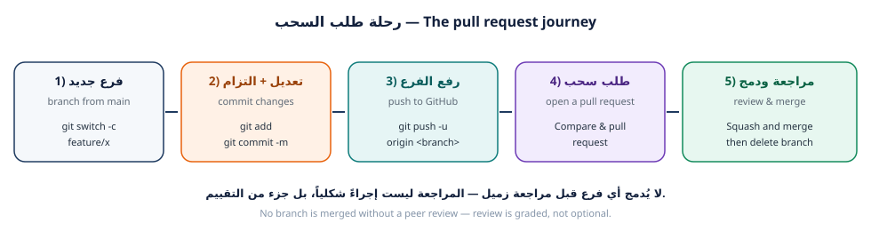

---
{
  "badge_n": "03",
  "badge_l": "ورقة عمل",
  "kicker": "ورشة Git وGitHub — البرنامج التدريبي العملي",
  "title": "فرعي الأول وطلب السحب الأول",
  "en_title": "Workshop 3 · My First Branch & Pull Request",
  "meta": [
    ["المدة / Duration", "90 دقيقة"],
    ["المستوى / Level", "متوسط — بعد ورقة 02"],
    ["المتطلبات / Prerequisites", "المستودع يعمل على جهازك"],
    ["المخرجات / Deliverable", "بطاقتك مدموجة في main"],
    ["المهام / Tasks", "6 مهام"],
    ["الدرجة / Points", "100 نقطة"]
  ],
  "footer": "ورشة Git وGitHub · ورقة عمل 03 — الفرع وطلب السحب",
  "en_footer": "Git & GitHub Workshop · Worksheet 03 — Branch & Pull Request"
}
---

:::band{ar="مهمة اليوم" en="Today's mission"}
:::

:::bi
اليوم ستقوم بأول **مساهمة حقيقية** في مشروع الفريق: تنشئ فرعاً باسمك، وتكتب ملف بطاقتك،
وتلتزم بالعمل، وترفع الفرع إلى GitHub، ثم تفتح **طلب سحب (Pull Request)** يشرح ما فعلته،
وتطلب مراجعة من زميل، وتردّ على ملاحظاته. هذه هي دورة عمل أي فريق برمجي في العالم.
---EN---
Today you make your first **real contribution**: create a branch, write your card file,
commit, push, open a **pull request**, request a peer review, and respond to feedback. This
is exactly how professional teams work.
:::

:::goal{ar="أهداف التعلّم" en="Learning objectives"}
- إنشاء فرع بشكل صحيح باستخدام `git switch -c` وتسميته باتفاقيات الفريق.
- كتابة ملف بطاقة JSON صحيح وتمريره في فحص المشروع تلقائياً.
- التمييز الدقيق بين `git add` و`git commit` وصياغة رسالة التزام مهنية.
- رفع الفرع بـ `git push -u origin <branch>` وقراءة رسالة الربط (upstream).
- فتح طلب سحب (Pull Request) بوصف واضح وربطه بمهمة (Issue).
- كتابة مراجعة بنّاءة لزميل والردّ على الملاحظات باحتراف.
:::

<figure class="dia"><figcaption>شكل 1: خمس مراحل من الفرع إلى الدمج <span class="en">— branch → commit → push → PR → review & merge</span></figcaption></figure>

:::box{type="rule" ar="لماذا نمنع العمل المباشر على main؟" en="Why is direct work on main blocked?"}
لأن `main` هو النسخة التي يعتمد عليها الجميع. لو رفع كل طالب تعديله مباشرة إلى `main`
لفقدنا القدرة على المراجعة، ولانهار المشروع عند أول خطأ. الفرع يعطيك مساحة آمنة
للتجربة، وطلب السحب يعطي الفريق فرصة الفحص قبل الدمج.
:::

:::band{type="alt" ar="الجزء الأول · الفرع" en="Part 1 · The branch"}
:::

## تصنيف الفروع وأسماؤها

:::bi
اسم الفرع رسالة للفريق. الاتفاقية المتبعة في المشروع: `type/username-topic`
حيث `type` نوع العمل (`feature`, `fix`, `docs`, `chore`)، و`username` اسمك على GitHub،
و`topic` وصف قصير بالإنجليزية.
---EN---
A branch name communicates intent. Team convention: `type/username-topic` where type is one of
`feature`, `fix`, `docs`, `chore`.
:::

| ✅ اسم فرع صحيح | ❌ اسم فرع خطأ | السبب |
|---|---|---|
| `feature/omar-qa-card` | `my-branch` | لا يدل على صاحبه ولا موضوعه |
| `docs/leen-readme-faq` | `test` | غامض، وتكرار `test` يفسد المشروع |
| `fix/sara-search-filter` | `sara/new/final/2` | شرطات لا مسارات، وبلا معنى |
| `chore/ali-regenerate-index` | `فرع علي` | حروف عربية ومسافة في اسم الفرع |

:::task{num="1" ar="حدّث main وافتح مطالبة عمل (Issue) لمهمتك" en="Update main and open an issue for your task" time="15 دقيقة" level="مبتدئ" pts="10" tools="git pull|GitHub Issues"}
**الهدف:** أن يبدأ العمل من أحدث نسخة، وأن يكون لعملك رقم مرجعي في المشروع.

**الخطوة 1 — زامن نسختك المحلية قبل أي شيء:**

:::term{title="Terminal — مزامنة قبل العمل"}
$ cd ~/projects/class-team-hub
$ git switch main
$ git pull --ff-only
remote: Enumerating objects: 12, done.
Updating 8de1e7a..a1b2c3d
Fast-forward
 data/members/ali-h.json | 9 +++++++++
 1 file changed, 9 insertions(+)

$ git log --oneline -3
a1b2c3d (HEAD -> main, origin/main) Merge pull request #7 from nour-dev/feature/nour-card
9f8e7d6 feat(members): add card for nour-dev
c4d5e6f Merge pull request #6 from ali-h/feature/ali-card
:::

:::box{type="err" ar="لا تتجاوز هذه الخطوة" en="Never skip this"}
من يبدأ العمل من نسخة قديمة سيصنع تعارضاً بنفسه بلا داعٍ، وسيضطر لحلّه لاحقاً. المزامنة
قبل كل فرع جديد عادة لا استثناء.
:::

**الخطوة 2 — افتح Issue في مستودع الفريق:**

1. اذهب إلى صفحة المستودع على GitHub ← تبويب **Issues** ← `New issue`.
2. اختر القالب `طلب ميزة / Feature request`.
3. العنوان: `إضافة بطاقة <اسم المستخدم> إلى دليل الفريق`.
4. اكتب في المشكلة: مَن أنت، وما الملف الذي ستضيفه، ومعيار القبول
   (`البطاقة تظهر في الصفحة، والفحص التلقائي ينجح`).
5. اضغط `Submit new issue` وسجّل الرقم (مثال: `#12`).

:::evidence{ar="دليل المطلوب" en="Evidence"}
- رقم المهمة: `#………` — رابطها: `https://github.com/……………………/class-team-hub/issues/………`
- مخرجات `git pull --ff-only`:

```
$ git pull --ff-only


```
:::

:::task{num="2" ar="أنشئ فرعك وتحقق من موقعك" en="Create your branch and verify where you are" time="10 دقائق" level="مبتدئ" pts="10" tools="git switch|git branch"}

:::term{title="Terminal — إنشاء الفرع"}
$ git switch -c feature/<username>-card
Switched to a new branch 'feature/omar-qa-card'

$ git branch
  main
* feature/omar-qa-card

$ git branch --show-current
feature/omar-qa-card

$ git status -sb
## feature/omar-qa-card
:::

:::bi
لاحظ علامة النجمة `*` في قائمة الفروع — تدل على الفرع الحالي. ومن الآن فصاعداً كل
التزاماتك تسقط على هذا الفرع، و`main` محفوظ سليم.
---EN---
The `*` marks your current branch. From now on every commit lands on this branch, leaving
`main` untouched.
:::

:::box{type="tip" ar="حيلة عملية" en="Practical tip"}
أضف اسم الفرع الحالي إلى «موجّه الطرفية» (prompt) أو راقبه في شريط VS Code السفلي
Before every command ask yourself: **على أي فرع أنا الآن؟**
:::

:::evidence{ar="دليل المطلوب" en="Evidence"}
الصق مخرجات `git branch` (يجب أن يظهر فرعك بنجمة):

```
$ git branch


```
:::

:::band{ar="الجزء الثاني · الكتابة والالتزام" en="Part 2 · Write and commit"}
:::

:::task{num="3" ar="اكتب ملف بطاقتك" en="Write your card file" time="20 دقيقة" level="متوسط" pts="20" tools="VS Code|JSON"}

**الخطوة 1 — انسخ القالب باسم مستخدمك:**

:::term{title="Terminal — نسخ القالب"}
$ cp data/members/00-template.json data/members/omar-qa.json
$ ls data/members/
00-template.json  01-example-student.json  99-you-instructor.json  ali-h.json  nour-dev.json  omar-qa.json
:::

**الخطوة 2 — افتح الملف واملأ الحقول الخمسة الإلزامية:**

```json
{
  "fullName": "اسمك الكامل",
  "github": "your-github-username",
  "role": "مطوّر",
  "favoriteCommand": "git status",
  "message": "جملة واحدة تعرّف بها عن نفسك (10 إلى 140 حرفاً).",
  "tags": ["HTML", "CSS"],
  "joinedAt": "2026-10-06"
}
```

| الحقل | الشرط | صحيح ✅ | خطأ ❌ |
|---|---|---|---|
| `fullName` | الاسم الحقيقي بلا ألقاب | `عمر القاسم` | `Mr.Pro` |
| `github` | حروف صغيرة وأرقام وشرطات فقط | `omar-qa` | `Omar_QA` |
| `role` | من القائمة المعتمدة | `مختبر QA` | `مبرمج خارق` |
| `favoriteCommand` | يبدأ بـ `git ` | `git log --oneline` | `ls -la` |
| `message` | 10–140 حرفاً | `أبحث عن الأخطاء قبل أن يجدها المستخدم.` | `` (فارغ) |

**الأدوار المعتمدة:** `مطوّر` · `مصمّم` · `مختبر QA` · `كاتب توثيق` · `قائد فريق`

:::box{type="err" ar="بيانات تُرفض" en="Rejected content"}
لا تضع بريداً إلكترونياً، رقم هاتف، عنواناً، رقم هوية، أو كلمة مرور. الفحص التلقائي
يرفض الملف، وقد يُطلب منك حذف الالتزام وإعادة العمل.
:::

**الخطوة 3 — أعِد توليد الفهرس ثم شغّل الفحص:**

:::term{title="Terminal — توليد الفهرس والتحقق"}
$ node tools/build-index.mjs
[build-index] ✓ تم توليد الفهرس: 6 بطاقة.
   • ali-h                 مطوّر
   • example-student        مطوّر
   • nour-dev               مصمّم
   • omar-qa                مختبر QA
   • you-instructor         قائد فريق

$ node tests/validate-members.mjs

=== فحص بطاقات الأعضاء / Validating member cards ===

--- النتيجة / Result: 6 بطاقة، 0 خطأ، 0 تحذير ---
:::

:::box{type="warn" ar="إن ظهرت أخطاء" en="If the validator fails"}
اقرأ أول سطر خطأ فقط وأصلحه، ثم أعد التشغيل. الرسائل مصمَّمة لتخبرك بالحقل المشكل
واسم الملف. لا تُكمل قبل أن تصبح النتيجة `0 خطأ`.
:::

:::evidence{ar="دليل المطلوب" en="Evidence"}
- الصق مخرجات الفحص الأخيرة (يجب أن تكون 0 خطأ):

```
$ node tests/validate-members.mjs


```
- الصق محتوى ملف بطاقتك:

```json


```
:::

:::task{num="4" ar="التزم وارفع فرعك" en="Commit and push your branch" time="15 دقيقة" level="متوسط" pts="20" tools="git add|git commit|git push"}

**الخطوة 1 — افحص ما ستلتزم به قبل الالتزام:**

:::term{title="Terminal — الفحص قبل الالتزام"}
$ git status -sb
## feature/omar-qa-card
 M data/members-bundle.js
 M data/members-index.json
?? data/members/omar-qa.json

$ git diff --stat
 data/members-bundle.js  | 13 +++++++++++++
 data/members-index.json |  3 ++-
 2 files changed, 15 insertions(+), 1 deletion(-)
:::

:::box{type="info" ar="اقرأ الرموز" en="Read the symbols"}
`??` ملف جديد غير متتبَّع · `M ` تعديل مُمرَّر للمرحلة · ` M` تعديل غير مُمرَّر.
تعلم قراءة `git status -sb` يجعل تشخيص أي مشكلة أسرع ثلاث مرات.
:::

**الخطوة 2 — التزم برسالة مهنية:**

:::term{title="Terminal — الالتزام"}
$ git add data/members/omar-qa.json data/members-index.json data/members-bundle.js
$ git commit -m "feat(members): add card for omar-qa"
[feature/omar-qa-card 89f5cff] feat(members): add card for omar-qa
 3 files changed, 25 insertions(+), 2 deletions(-)
 create mode 100644 data/members/omar-qa.json
:::

**صيغة رسالة الالتزام المعتمدة (Conventional Commits):**

```text
<type>(<scope>): <وصف قصير بصيغة الأمر>
```

| Type | الاستخدام | مثال |
|---|---|---|
| `feat` | إضافة جديدة | `feat(members): add card for omar-qa` |
| `fix` | إصلاح خطأ | `fix(ui): correct card alignment on mobile` |
| `docs` | توثيق فقط | `docs(readme): add FAQ section` |
| `style` | تنسيق بلا تغيير سلوك | `style(css): reorder card properties` |
| `chore` | صيانة وأدوات | `chore(index): regenerate members index` |

:::box{type="err" ar="رسائل مرفوضة" en="Rejected messages"}
`update` · `changes` · `final` · `done` · `asdf` · `.` — هذه الرسائل لا تشرح شيئاً
للمراجع، وتُحسب عليك في تقييم الورقة.
:::

**الخطوة 3 — ارفع الفرع واربطه بالخادم:**

:::term{title="Terminal — الرفع"}
$ git push -u origin feature/omar-qa-card
Enumerating objects: 8, done.
Counting objects: 100% (8/8), done.
Writing objects: 100% (5/5), 742 bytes | 742.00 KiB/s, done.
Total 5 (delta 1), reused 0 (delta 0), pack-reused 0
remote:
remote: Create a pull request for 'feature/omar-qa-card' on GitHub by visiting:
remote:      https://github.com/school-git-workshop/class-team-hub/pull/new/feature/omar-qa-card
remote:
To https://github.com/school-git-workshop/class-team-hub.git
 * [new branch]      feature/omar-qa-card -> feature/omar-qa-card
branch 'feature/omar-qa-card' set up to track 'origin/feature/omar-qa-card'.
:::

:::box{type="tip" ar="معنى -u" en="What -u does"}
`-u` تسجّل الربط بين فرعك المحلي والفرع البعيد، فتستطيع بعدها كتابة `git push` و`git pull`
بلا تحديد الاسم. افحص ذلك بـ `git branch -vv` وسترى `[origin/feature/omar-qa-card]`.
:::

:::evidence{ar="دليل المطلوب" en="Evidence"}
- الصق مخرجات `git push -u origin feature/<username>-card`:

```
$ git push -u origin feature/omar-qa-card


```
- الصق مخرجات `git branch -vv`:

```
$ git branch -vv


```
:::

:::band{type="violet" ar="الجزء الثالث · طلب السحب والمراجعة" en="Part 3 · Pull request & review"}
:::

:::task{num="5" ar="افتح طلب سحب واطلب مراجعة زميل" en="Open a pull request and request a peer review" time="20 دقيقة" level="متوسط" pts="20" tools="GitHub|Pull Request"}

**الخطوة 1 — افتح طلب السحب:**

1. افتح الرابط الذي ظهر في مخرجات `git push` (أو تبويب `Pull requests` ← `New pull request`).
2. تأكد: `base: main` ← `compare: feature/omar-qa-card`.
3. اكتب **عنواناً** بنفس صيغة رسالة الالتزام: `feat(members): add card for omar-qa`.
4. املأ القالب بالكامل، وخصوصاً:
   - **ماذا تغيّر:** «أضفت ملف بطاقتي `data/members/omar-qa.json` وأعدت توليد الفهرس».
   - **الأدلة:** الصق مخرجات `node tests/validate-members.mjs`.
   - **الربط:** اكتب `Closes #12` ليرتبط الطلب بمهمتك ويُغلق تلقائياً عند الدمج.
5. **Reviewers** ← اختر زميلاً. **Assignees** ← نفسك.
6. اضغط `Create pull request`.

:::box{type="warn" ar="لا تضغط Merge" en="Do not press Merge"}
الدمج مسؤولية المراجع أو المدرّب. من يدمج فرعه بنفسه بلا مراجعة يفقد 15 نقطة من هذه
الورقة — لأن المراجعة مهارة مقصودة في التدريب لا إجراء شكلي.
:::

**الخطوة 2 — راجع طلب سحب زميلك.** افتح `Pull requests` ← اختر طلباً لزميل ← تبويب
`Files changed` ← `Add review comment`.

اقلبه على قواعد المراجعة:

| افعل ✅ | لا تفعل ❌ |
|---|---|
| «الحقل `favoriteCommand` لا يبدأ بـ `git`، هل تصححه؟» | «كودك خاطئ» |
| «هل تريد إضافة وسم `JavaScript` أيضاً؟» | «افعله بشكل صحيح» |
| «ممتاز، البطاقة تظهر بشكل نظيف ✅» | «موافق» بلا أي تفصيل |
| اقتراح تحسين واحد واضح | إطلاق أحكام على الشخص |

**الخطوة 3 — ردّ على مراجعة زميلك أنت.** أجب على تعليق واحد على الأقل: إما تصحيح
والتزام جديد على نفس الفرع، أو شرح مقنع. ثم اضغط `Resolve conversation`.

:::evidence{ar="دليل المطلوب" en="Evidence"}
| البند | القيمة |
|---|---|
| رقم طلب سحبك | `#………` |
| رابط طلب سحبك | `…………………………………` |
| اسم الزميل الذي راجعك | `…………………………………` |
| اسم الزميل الذي راجعته | `…………………………………` |
| رقم طلب السحب الذي راجعته | `#………` |

الصق نص تعليق المراجعة الذي كتبته لزميلك:

```
…………………………………………………………………………………………………………
```
:::

:::task{num="6" ar="استجب للملاحظات وأكمل مهمتك" en="Respond to feedback and finish" time="10 دقائق" level="متوسط" pts="10" tools="git commit|git push"}

**الهدف:** تجربة دورة المراجعة الفعلية: ملاحظة ← تصحيح ← التزام إضافي ← إعادة فحص.

:::term{title="Terminal — تصحيح بعد مراجعة"}
# مثال: المراجع طلب إضافة وسم JavaScript إلى بطاقتك
$ nano data/members/omar-qa.json       # أو افتحه في VS Code وعدّل tags
$ node tools/validate-members.mjs
--- النتيجة / Result: 6 بطاقة، 0 خطأ، 0 تحذير ---

$ git add data/members/omar-qa.json
$ git commit -m "fix(members): add JavaScript tag per review feedback"
[feature/omar-qa-card 3c7d9e1] fix(members): add JavaScript tag per review feedback
 1 file changed, 1 insertion(+), 1 deletion(-)

$ git push
To https://github.com/school-git-workshop/class-team-hub.git
   89f5cff..3c7d9e1  feature/omar-qa-card -> feature/omar-qa-card
:::

:::bi
لاحظ أن **نفس طلب السحب** تحدّث تلقائياً — لم تفتح طلباً جديداً. هذه قوة الفروع:
طلب السحب يعرض كل ما على الفرع حتى لحظة الدمج.
---EN---
Notice the pull request updated itself — no new PR needed. A PR always shows the current state
of your branch until it is merged.
:::

:::evidence{ar="دليل المطلوب" en="Evidence"}
الصق مخرجات `git log --oneline` على فرعك (يجب أن يظهر التزامان أو أكثر):

```
$ git log --oneline


```
سجّل ما تعلّمته من ملاحظة المراجع (سطر واحد):

```
…………………………………………………………………………………………………………
```
:::

:::band{type="green" ar="قبل التسليم" en="Before you submit"}
:::

## أسئلة تحقّق سريعة

**س1.** ما الفرق بين `git switch -c feature/x` و`git switch feature/x`؟

:::write{n=2 label="إجابتك / Your answer"}
:::

**س2.** لماذا نزامن `main` **قبل** إنشاء الفرع، لا بعده؟

:::write{n=3 label="إجابتك / Your answer"}
:::

**س3.** ما معنى `Closes #12` في وصف طلب السحب؟

:::write{n=2 label="إجابتك / Your answer"}
:::

**س4.** اكتب رسالة التزام صحيحة لمهمة «إصلاح محاذاة البطاقة في الجوال».

:::write{n=2 label="إجابتك / Your answer"}
:::

:::check{ar="قائمة الفحص النهائية" en="Final checklist"}
- [ ] المهمة (Issue) مفتوحة وتحمل رقمها
- [ ] فرع باسم صحيح حسب الاتفاقية، وبدأ من `main` محدَّث
- [ ] ملف البطاقة صحيح، و`node tests/validate-members.mjs` بلا أخطاء
- [ ] التزام واحد على الأقل برسالة بصيغة Conventional Commits
- [ ] الفرع مرفوع ومربوط، و`git branch -vv` يُظهر التتبّع
- [ ] طلب سحب مفتوح، ووصفه يشمل الأدلة و`Closes #…`
- [ ] مراجعة مكتوبة لزميل، وردّ على ملاحظة وردت لي
:::

:::evidence{ar="بطاقة التسليم" en="Submission card"}
| البند | القيمة |
|---|---|
| اسم الفرع | `feature/……………………………` |
| عدد الالتزامات | ………… |
| رقم المهمة (Issue) | `#………` |
| رقم طلب السحب | `#………` |
| حالة طلب السحب | ☐ مفتوح  ☐ تمت الموافقة  ☐ مدموج |
:::

:::box{type="info" ar="ما القادم؟" en="What's next"}
في **ورقة العمل 04** سترى أثر تعديلات زملائك بعد دمجها، وتتعلم كيف تجلب تحديثاتهم
إلى جهازك، وكيف يعمل **الدمج (Merge)**، وكيف تسترجع أي تعديل أفسد المشروع.
:::
