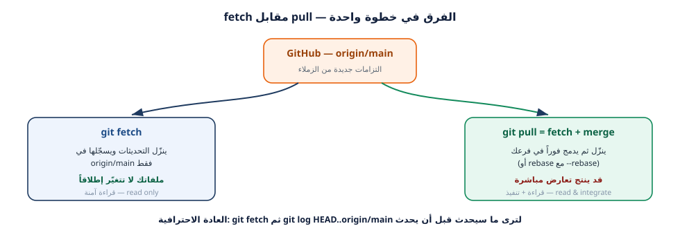
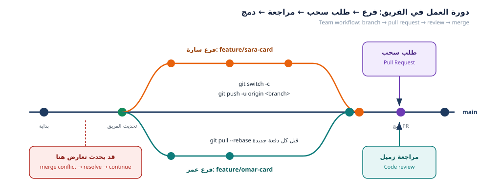

---
{
  "badge_n": "04",
  "badge_l": "ورقة عمل",
  "kicker": "ورشة Git وGitHub — البرنامج التدريبي العملي",
  "title": "مزامنة الفريق: كيف أرى تعديلات زملائي؟",
  "en_title": "Workshop 4 · Sync & Merge — Seeing Teammates' Changes",
  "meta": [
    ["المدة / Duration", "90 دقيقة"],
    ["المستوى / Level", "متوسط — بعد ورقة 03"],
    ["المتطلبات / Prerequisites", "طلب سحب مفتوح أو مدموج"],
    ["المخرجات / Deliverable", "main محدَّث على جهازك + تقرير فريق"],
    ["المهام / Tasks", "6 مهام"],
    ["الدرجة / Points", "100 نقطة"]
  ],
  "footer": "ورشة Git وGitHub · ورقة عمل 04 — المزامنة والدمج",
  "en_footer": "Git & GitHub Workshop · Worksheet 04 — Sync & Merge"
}
---

:::band{ar="فكرة الورقة" en="The big idea"}
:::

:::bi
مشكلة كل فريق مبتدئ: «زميلي أضاف تعديلاً… وأنا لا أراه!». اليوم سنجيب على هذا السؤال
عملياً: كيف تنتقل تعديلات الزملاء من مستودعهم إلى جهازك، وكيف يعمل **الدمج (merge)**
خلف الكواليس، وما استراتيجيات الدمج الثلاث، وكيف ترجع عن تعديل أفسد شيئاً.
---EN---
Every beginner team hits the same wall: “my teammate pushed a change… and I can't see it!”
Today we answer that hands-on: how your teammates' work travels from their machine to yours,
how **merge** really works, which merge strategies exist, and how to undo a bad change.
:::

:::goal{ar="أهداف التعلّم" en="Learning objectives"}
- فهم الفرق بين `git fetch` و`git pull` و`git pull --rebase` ومتى يُستخدم كل منها.
- تجربة الدمج الحقيقي ومعاينة النتيجة قبل الدمج بـ `--no-commit`.
- التمييز بين استراتيجيات الدمج الثلاث (Merge / Squash / Rebase) وتأثيرها على التاريخ.
- رؤية تعديلات الزملاء ومراجعتها بالأوامر: `diff`, `log -p`, `blame`, `shortlog`.
- تنظيف الفروع المدموجة بأمان والعمل بأسلوب «فرع واحد = مهمة واحدة».
- التراجع بثقة: `restore` و`commit --amend` و`revert` و`reset` و`stash`.
:::

:::band{type="alt" ar="الجزء الأول · جلب تعديلات الفريق" en="Part 1 · Bringing in team updates"}
:::

:::task{num="1" ar="fetch أو pull؟ اعرف الفرق عملياً" en="fetch or pull? Learn the difference by doing" time="15 دقيقة" level="مبتدئ" pts="15" tools="git fetch|git pull|git diff"}

:::bi
`git fetch` ينزّل تحديثات الخادم إلى جهازك **دون** أن يغيّر ملفاتك — إنه مثل «فتح
البريد وقراءته»، أما `git pull` فهو `fetch` متبوعاً بدمج (أو إعادة تشكيل)، أي «قراءة
البريد وتنفيذ ما فيه فوراً».
---EN---
`fetch` downloads new objects but changes nothing in your working files; `pull` is fetch plus
integration (merge or rebase).
:::

:::term{title="Terminal — فلنشاهد الفرق بأنفسنا"}
$ git switch main
$ git fetch origin
remote: Enumerating objects: 9, done.
Unpacking objects: 100% (9/9), done.
From https://github.com/school-git-workshop/class-team-hub
   a1b2c3d..f9e8d7c  main       -> origin/main

$ git status -sb
## main...origin/main [behind 2]

$ git log --oneline HEAD..origin/main
f9e8d7c feat(members): add card for leen-docs
3c7d9e1 Merge pull request #7 from nour-dev/feature/nour-card
:::

<figure class="dia"><figcaption>شكل 1: fetch يقرأ فقط، pull يقرأ ويدمج <span class="en">— fetch reads, pull integrates</span></figcaption></figure>

:::box{type="tip" ar="عادة احترافية" en="Professional habit"}
افحص دائماً قبل الدمج: `git fetch` ثم `git log --oneline HEAD..origin/main` ثم
`git diff HEAD..origin/main`. تقرأ ما سيحدث قبل أن يحدث — وهذا يمنع معظم المفاجآت.
:::

:::evidence{ar="دليل المطلوب" en="Evidence"}
- الصق مخرجات `git status -sb` بعد `fetch` واذكر أين أنت (متقدّم/متأخر/متساوٍ):

```
$ git status -sb


```
- اذكر عدد الالتزامات التي جاء بها الزملاء (`behind N`): …………
- أسماء الزملاء الذين ظهروا في `git log`: ……………………………………
:::

:::task{num="2" ar="ادمج تحديثات الفريق في main" en="Merge the team updates into main" time="15 دقيقة" level="مبتدئ" pts="15" tools="git pull --ff-only|git merge"}

**الطريق الأفضل عندما لا يوجد تعارض — الدمج السريع (fast-forward):**

:::term{title="Terminal — الدمج السريع"}
$ git merge --ff-only origin/main
Updating a1b2c3d..f9e8d7c
Fast-forward
 data/members/leen-docs.json | 9 +++++++++
 data/members-index.json     | 5 +++--
 2 files changed, 13 insertions(+), 4 deletions(-)

$ git status
On branch main
Your branch is up to date with 'origin/main'.
:::

:::box{type="info" ar="ما معنى Fast-forward؟" en="What is fast-forward?"}
تعني أن `main` المحلي لم يكن فيه أي عمل خاص بك، فكل ما احتاجه Git هو «تقديم المؤشر»
إلى الأمام بلا إنشاء التزام دمج. التاريخ يبقى خطاً نظيفاً بلا عُقد.
:::

**الطريق الثاني عندما يوجد عمل متبادل — دمج بعقدة (merge commit):**

:::term{title="Terminal — دمج بعقدة"}
$ git merge feature/omar-qa-card
Merge made by the 'ort' strategy.
 data/members/omar-qa.json | 9 +++++++++
 1 file changed, 9 insertions(+)
 create mode 100644 data/members/omar-qa.json
:::

:::box{type="warn" ar="أخطاء شائعة" en="Common pitfalls"}
| الرسالة | السبب | الحل |
|---|---|---|
| `fatal: Not possible to fast-forward` | يوجد عمل على الطرفين | استخدم `git merge` بلا `--ff-only` |
| `fatal: refusing to merge unrelated histories` | مستودعان غير مرتبطين | `git pull --allow-unrelated-histories` |
| `error: Your local changes would be overwritten` | تعديلات محلية غير محفوظة | `git stash` ثم الدمج ثم `git stash pop` |
:::

:::evidence{ar="دليل المطلوب" en="Evidence"}
الصق مخرجات عملية الدمج التي نفّذتها، وحدّد أي نوع دمج وقع:

```
$ git merge ……………………………


```
نوع الدمج: ☐ fast-forward  ☐ merge commit  ☐ لا يوجد تغيير (already up to date)
:::

:::band{ar="الجزء الثاني · الدمج باستراتيجيات مختلفة" en="Part 2 · Merge strategies"}
:::

<figure class="dia"><figcaption>شكل 2: دورة العمل الكاملة — فرع، طلب سحب، مراجعة، دمج إلى main <span class="en">— the full team cycle</span></figcaption></figure>

:::task{num="3" ar="جرب الدمج الثلاث بأساليب مختلفة" en="Try all three merge strategies" time="15 دقيقة" level="متقدم" pts="15" tools="git merge|--squash|rebase"}
**الهدف:** أن تفرّق بنفسك بين أثر الاستراتيجيات الثلاث على تاريخ المشروع.

:::bi
على GitHub سترى في زر الدمج ثلاث خيارات: `Create a merge commit` و`Squash and merge`
و`Rebase and merge`. كل خيار يُنتج تاريخاً مختلف الشكل. جربها محلياً قبل أن تضغطها.
---EN---
On GitHub the merge button offers three modes. Try them locally first so you know exactly what
each one does to history.
:::

**تجربة 1 — دمج بعقدة (merge commit):**

:::term{title="Terminal — merge commit"}
$ git switch main
$ git merge --no-ff feature/ali-card -m "Merge pull request #6 from ali-h/feature/ali-card"
$ git log --oneline --graph -4
*   5b6c7d8 (HEAD -> main) Merge pull request #6 from ali-h/feature/ali-card
|\
| * 1a2b3c4 feat(members): add card for ali-h
|/
* f9e8d7c feat(members): add card for leen-docs
:::

**تجربة 2 — الدمج المضغوط (squash):**

:::term{title="Terminal — squash merge"}
$ git switch main
$ git merge --squash feature/sara-fixes
Squash commit -- not updating HEAD
Automatic merge went well; stopped before committing as requested

$ git commit -m "feat(ui): improve member card layout (#9)"
[main 7a8b9c0] feat(ui): improve member card layout (#9)
 2 files changed, 18 insertions(+), 6 deletions(-)

$ git log --oneline -2
7a8b9c0 (HEAD -> main) feat(ui): improve member card layout (#9)
5b6c7d8 Merge pull request #6 from ali-h/feature/ali-card
:::

:::box{type="tip" ar="أهم استنتاج" en="Key takeaway"}
لاحظ أن التزامات سارة الثلاثة صارت **التزاماً واحداً** نظيفاً على `main`. هذا أفضل خيار
لفروع صغيرة كثيرة الالتزامات غير المهمة (مثل `fix` ثم `fix` ثم `fix`).
:::

**تجربة 3 — إعادة التشكيل (rebase):**

:::term{title="Terminal — rebase"}
$ git switch feature/nour-card
$ git rebase main
Successfully rebased and updated refs/heads/feature/nour-card.

$ git log --oneline --graph -4
* 4d5e6f7 (HEAD -> feature/nour-card) feat(members): add card for nour-dev
* 5b6c7d8 Merge pull request #6 from ali-h/feature/ali-card
* 1a2b3c4 feat(members): add card for ali-h
* f9e8d7c feat(members): add card for leen-docs
:::

| الاستراتيجية | شكل التاريخ | متى نستخدمها |
|---|---|---|
| Merge commit | فروع وعُقد واضحة | فرع طويل بمهام متعددة |
| Squash | التزام واحد نظيف | فرع صغير، أو إصلاحات متتابعة |
| Rebase | خط مستقيم بلا عُقد | تاريخ خطّي للعرض والمراجعة |

:::box{type="err" ar="محذور" en="Never do this"}
لا تنفّذ `rebase` على فرع **مشترك** يعمل عليه زملاؤك، لأنها تعيد كتابة التاريخ وتسبب
فوضى عندهم. القاعدة: **rebase للفروع الشخصية، merge للفروع المشتركة.**
:::

:::evidence{ar="دليل المطلوب" en="Evidence"}
- الصق مخرجات `git log --oneline --graph -6` بعد تجربة squash + rebase:

```
$ git log --oneline --graph -6


```
سؤال: أي استراتيجية تفضّل لمشروع فريق فيه 20 طالباً يضيفون بطاقات؟ ولماذا؟ (سطران)
:::

:::task{num="4" ar="شاهد تعديلات زملائك وافحص مصدرها" en="Inspect your teammates' changes and their origin" time="15 دقيقة" level="متوسط" pts="15" tools="git log -p|git blame|git shortlog"}
**الهدف:** أن تجيب بدقة: من عدّل هذا السطر؟ ومتى؟ ولماذا؟ — مهارة المراجعة الأساسية.

:::term{title="Terminal — فحص تعديل زميل"}
$ git log --oneline --all --graph --decorate -12
* f9e8d7c (origin/main, origin/HEAD, main) feat(members): add card for leen-docs
*   3c7d9e1 Merge pull request #7 from nour-dev/feature/nour-card
|\
| * 8c9d0e1 (origin/feature/nour-card) feat(members): add card for nour-dev
|/
* a1b2c3d Merge pull request #6 from ali-h/feature/ali-card
|\
| * 1a2b3c4 (origin/feature/ali-card) feat(members): add card for ali-h
|/
* 8de1e7a chore: initial commit of class-team-hub

$ git log -p -- data/members/leen-docs.json
commit f9e8d7c9a8b7c6d5e4f3a2b1c0d9e8f7a6b5c4d3
Author: leen-docs <leen@example.com>
Date:   Mon Oct 6 11:02:40 2026 +0300

    feat(members): add card for leen-docs

+{
+  "fullName": "لينا حدّاد",
+  "github": "leen-docs",
+  "role": "كاتب توثيق",
+  "favoriteCommand": "git diff main..HEAD --stat",
+  "message": "أكتب التوثيق الذي يجعل المشروع مفهوماً لأي طالب جديد في دقيقتين.",
+  "tags": ["Markdown", "Documentation"],
+  "joinedAt": "2026-10-06"
+}

$ git blame data/members/leen-docs.json
f9e8d7c9 (leen-docs 2026-10-06 11:02:40 +0300 1) {
f9e8d7c9 (leen-docs 2026-10-06 11:02:40 +0300 2)   "fullName": "لينا حدّاد",
:::

:::box{type="tip" ar="أمر يعجب المدرّبين" en="An instructor favourite"}
`git shortlog -sn --all` يعطيك ترتيب المساهمين بعدد الالتزامات، و`git log --author="omar"`
يعطيك كل ما فعله شخص واحد. استخدمهما في تقرير الفريق النهائي (المهمة 6).
:::

:::evidence{ar="دليل المطلوب" en="Evidence"}
| السؤال | جوابك |
|---|---|
| من عدّل `data/members-index.json` آخر مرة؟ ولاحظ: هل عدّله أكثر من شخص؟ | `………………………` |
| عدد الالتزامات لكل زميل حسب `git shortlog -sn --all` | `……………………………` |
| هل نسخة `main` عندك متساوية مع `origin/main`؟ (`git status`) | `☐ نعم  ☐ لا` |

الصق مخرجات `git log --oneline --graph --all --decorate -10`:

```
$ git log --oneline --graph --all --decorate -10


```
:::

:::band{type="violet" ar="الجزء الثالث · التراجع الآمن" en="Part 3 · Safe undo"}
:::

:::task{num="5" ar="مختبر التراجع: أفسد شيئاً ثم استرجع" en="Undo lab: break something and recover" time="15 دقيقة" level="متقدم" pts="20" tools="restore|amend|revert|reset|stash"}
**الهدف:** أن تتصرف بثقة عند أي خطأ، وتعرف أي أمر يتراجع عن أي حالة.

:::bi
أغلب أوامر Git لا تُفني عملك — إنها فقط تنقل المؤشر. والمفتاح الذي ينقذك دائماً هو
`git reflog` (سجل كل حركات HEAD). لكن الأمرين الوحيدين الذين يحذفان فعلاً بلا رجعة
هما `git reset --hard` و`git restore` على ملف لم تُلتزمه.
---EN---
Most Git commands don't destroy work — they move pointers. Your safety net is `git reflog`.
The only genuinely destructive ones are `git reset --hard` and `git restore` on uncommitted work.
:::

**الحالة 1 — تعديل محلي فاسد لم تُلتزمه بعد:**

:::term{title="Terminal — التراجع عن تعديل غير مُلتزم"}
$ echo "كلام فاسد" >> README.md
$ git status -s
 M README.md

$ git restore README.md
$ git status -s
(لا مخرجات — الملف عاد لحالته الأخيرة)
:::

**الحالة 2 — التزام رسالته خاطئة ولم يُرفع بعد:**

:::term{title="Terminal — تعديل آخر التزام"}
$ git commit --amend -m "docs(readme): add FAQ section"
[main 2b3c4d5] docs(readme): add FAQ section
 Date: Mon Oct 6 11:40:02 2026 +0300
 1 file changed, 4 insertions(+)
:::

**الحالة 3 — التزام مرفوع إلى GitHub (لا تعدّل التاريخ!):**

:::term{title="Terminal — التراجع بالعكس (revert)"}
$ git revert --no-edit 8de1e7a
[main 6f7e8d9] Revert "feat(ui): change card colors"
 1 file changed, 3 insertions(+), 3 deletions(-)

$ git log --oneline -3
6f7e8d9 (HEAD -> main) Revert "feat(ui): change card colors"
2b3c4d5 docs(readme): add FAQ section
8de1e7a feat(ui): change card colors
:::

:::box{type="info" ar="لماذا revert وليس reset؟" en="Why revert, not reset?"}
`revert` ينشئ التزاماً جديداً يعكس الأول — فيبقى التاريخ صحيحاً لكل من سحب المشروع.
أما `reset --hard` فيحذف الالتزامات، ولو كان أحدهم قد بنى عليها عملاً انهار مشروعه.
:::

**الحالة 4 — تحتاج تبديل فرع وعملك غير مكتمل:**

:::term{title="Terminal — الحفظ المؤقت"}
$ git stash push -m "عمل غير مكتمل على البطاقة"
Saved working directory and index state On feature/omar-card: عمل غير مكتمل على البطاقة

$ git stash list
stash@{0}: On feature/omar-card: عمل غير مكتمل على البطاقة

$ git switch main          # غيّر الفرع بأمان
$ git switch feature/omar-card
$ git stash pop
On branch feature/omar-card
Changes not staged for commit:
        modified:   data/members/omar-qa.json
Dropped refs/stash@{0} (a7deb6a...)
:::

**الحالة 5 — شبكة الأمان الأخيرة:**

:::term{title="Terminal — reflog"}
$ git reflog -8
6f7e8d9 HEAD@{0}: revert: Revert "feat(ui): change card colors"
2b3c4d5 HEAD@{1}: commit (amend): docs(readme): add FAQ section
1e1682a HEAD@{2}: commit: docs(readme): add faq
5aaeef2 HEAD@{3}: reset: moving to origin/main
d107715 HEAD@{4}: checkout: moving from main to feature/omar-card
…

# استرجاع أي حالة سابقة من السجل:
$ git switch -c rescue 5aaeef2      # أو: git reset --hard 5aaeef2
:::

| الحالة | الأمر الصحيح | هل يحذف عملاً؟ |
|---|---|---|
| تعديل غير مُلتزم | `git restore <file>` | نعم (هو المقصود) |
| ملف مُمرَّر للمرحلة خطأً | `git restore --staged <file>` | لا |
| آخر التزام لم يُرفع | `git commit --amend` أو `git reset --soft HEAD~1` | لا |
| التزام مرفوع | `git revert <sha>` | لا (يعكسه) |
| تبديل فرع وعملك ناقص | `git stash` ثم `git stash pop` | لا |
| حذفت شيئاً ولا تدري | `git reflog` ثم `git switch -c rescue <sha>` | لا |

:::evidence{ar="دليل المطلوب" en="Evidence"}
- نفّذ الحالة 4 (stash) والصق مخرجات `git stash list`:

```
$ git stash list


```
- الصق آخر 5 أسطر من `git reflog`:

```
$ git reflog -5


```
- سؤال: زميلك حذف ملفاً والتزم الحذف ثم رفعه، فكيف ترجعه دون إفساد تاريخ الفريق؟
  (سطران)
:::

:::task{num="6" ar="نظّف الفروع واكتب تقرير الفريق" en="Clean up branches and write the team report" time="15 دقيقة" level="متوسط" pts="20" tools="git branch -d|git shortlog|git log"}
**الهدف:** مستودع نظيف + تقرير موجز يثبت أنك تعرف ما جرى في المشروع.

**الخطوة 1 — احذف الفروع المدموجة فقط:**

:::term{title="Terminal — تنظيف الفروع"}
$ git branch --merged main
  feature/ali-card
  feature/leen-card
* main

$ git branch -d feature/ali-card feature/leen-card
Deleted branch feature/ali-card (was 1a2b3c4).
Deleted branch feature/leen-card (was f9e8d7c).

$ git fetch --prune
 - [deleted]         (none)     -> origin/feature/ali-card
 - [deleted]         (none)     -> origin/feature/leen-card
:::

:::box{type="warn" ar="انتبه" en="Careful"}
`git branch --merged` يعرض الفروع التي اندمج عملها بالفعل — احذف هذه فقط. أما الفرع
غير المدموج فيحتاج `-D` (وهو حذف قسري) ولا تستخدمه إلا بعد التأكد أن عملك محفوظ أو مرفوع.
:::

**الخطوة 2 — ابنِ تقرير الفريق (يُسلَّم مع هذه الورقة):**

:::term{title="Terminal — بيانات التقرير"}
$ git log --oneline main | wc -l                    # عدد الالتزامات
$ git shortlog -sn --all                            # المساهمون
$ git log --since="2 weeks ago" --pretty="%an" | sort -u   # من عمل خلال أسبوعين
$ git log --oneline -- data/members/ | wc -l        # عدد الالتزامات على ملفات البطاقات
$ git ls-files data/members/ | wc -l                # عدد البطاقات
:::

:::evidence{ar="تقرير الفريق — يُسلَّم" en="Team report — to submit"}
| المؤشر | القيمة |
|---|---|
| عدد الالتزامات في `main` | ………… |
| عدد أعضاء الفريق (بطاقات) | ………… |
| أكثر عضو التزامات | `……………………………` بعدد ………… |
| عدد الفروع المحذوفة بعد الدمج | ………… |
| هل كل الفروع مدمجة الآن؟ (`git branch --merged main`) | ☐ نعم  ☐ لا |

اكتب في 3 أسطر: ما الذي كان سيحدث لو رفع كل طالب تعديله مباشرة إلى `main`؟

```
……………………………………………………………………………………………………………………
```
:::

:::band{type="green" ar="قبل التسليم" en="Before you submit"}
:::

## أسئلة تحقّق سريعة

**س1.** ما الفرق بين `git fetch` و`git pull`؟ ومتى يكون `fetch` أأمن؟

:::write{n=2 label="إجابتك / Your answer"}
:::

**س2.** متى تختار Squash ومتى تختار Merge commit؟ أعط مثالاً لكل حالة من مشروعنا.

:::write{n=3 label="إجابتك / Your answer"}
:::

**س3.** لماذا لا يجوز `rebase` لفرع مشترك؟ وما البديل؟

:::write{n=2 label="إجابتك / Your answer"}
:::

**س4.** زميلك رفع تعديلاً خاطئاً على `main`، فكيف تعالجه بأمان؟ اكتب الأمر.

:::write{n=2 label="إجابتك / Your answer"}
:::

:::check{ar="قائمة الفحص النهائية" en="Final checklist"}
- [ ] جربت `fetch` ثم `merge` وأنا أعرف الفرق عملياً
- [ ] جربت الدمج بالاستراتيجيات الثلاث (merge / squash / rebase)
- [ ] استخدمت `git log -p` و`git blame` للتحقيق في تعديل زميل
- [ ] جربت `stash` و`amend` و`revert` و`reflog`
- [ ] الفروع المدموجة نظّفت، والمستودع بلا فروع ميتة
- [ ] تقرير الفريق مملوء بالأرقام الفعلية لا بالتقدير
:::

:::evidence{ar="بطاقة التسليم" en="Submission card"}
| البند | القيمة |
|---|---|
| حالة `main` مقارنة بـ `origin/main` | ☐ متساويان  ☐ متقدم  ☐ متأخر |
| استراتيجية الدمج التي أفضل | ☐ Merge  ☐ Squash  ☐ Rebase |
| الأمر الذي أنقذني اليوم | `…………………………………` |
| الوقت المستغرق | ………… |
:::

:::box{type="info" ar="ما القادم؟" en="What's next"}
في **ورقة العمل 05** سنسبّب **تعارضاً حقيقياً عن قصد** بين تعديلين على السطر نفسه،
ونحلّه خطوة بخطوة — ثم ننهي المشروع بالنشر على GitHub Pages.
:::
