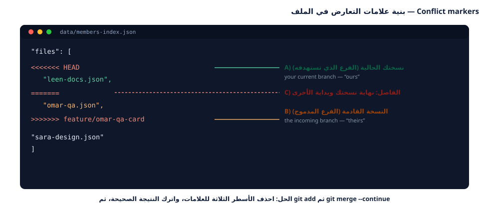

---
{
  "badge_n": "05",
  "badge_l": "ورقة عمل",
  "kicker": "ورشة Git وGitHub — البرنامج التدريبي العملي",
  "title": "حل التعارضات النهائية والنشر",
  "en_title": "Workshop 5 · Resolve Conflicts & Ship the Project",
  "meta": [
    ["المدة / Duration", "120 دقيقة"],
    ["المستوى / Level", "متقدم — الورقة الختامية"],
    ["المتطلبات / Prerequisites", "إتمام الأوراق 01–04"],
    ["المخرجات / Deliverable", "تعارض محلوول + موقع منشور + تقرير"],
    ["المهام / Tasks", "6 مهام"],
    ["الدرجة / Points", "100 نقطة"]
  ],
  "footer": "ورشة Git وGitHub · ورقة عمل 05 — التعارضات والنشر",
  "en_footer": "Git & GitHub Workshop · Worksheet 05 — Conflicts & Deployment"
}
---

:::band{ar="مرحباً في التحدي الأخير" en="Welcome to the final challenge"}
:::

:::bi
كل ما تعلّمته حتى الآن كان تمهيداً لهذه الورقة. اليوم ستصنع **تعارضاً عن قصد** لتتعلم
كيف يُحلّ بأمان، ثم تعالج التفاف التاريخ بـ `rebase`، ثم تنشر موقع الفريق على الإنترنت
عبر GitHub Pages، وأخيراً تكتب تقريراً نهائياً عن المشروع وعن نفسك.
---EN---
Everything so far was preparation. Today you deliberately create a conflict and resolve it,
handle rebasing, publish the team site with GitHub Pages, and write your final project report.
:::

:::goal{ar="أهداف التعلّم" en="Learning objectives"}
- فهم متى يحدث التعارض ومَن المسؤول عن حلّه (لا Git ولا الزميل: أنتما معاً).
- قراءة علامات التعارض (`<<<<<<<` `=======` `>>>>>>>`) وتفسيرها بدقة.
- حل نوعين مختلفين: تعارض سطر واحد، وتعارض ملف مُولَّد آلياً.
- استخدام `git rebase` وفهم الفرق بين معنى `HEAD` في merge وrebase.
- الدفع الآمن بـ `--force-with-lease` بعد إعادة التشكيل.
- النشر على GitHub Pages وتوثيق التنظيم النهائي للمشروع.
:::

:::band{type="alt" ar="الجزء الأول · فهم التعارض" en="Part 1 · Understanding conflicts"}
:::

:::box{type="rule" ar="حقيقة يجب أن تعرفها" en="A fact you must know"}
التعارض **ليس خطأً** وليس فشلاً، بل رسالة من Git تقول: «تعديلان مختلفان على نفس المكان،
ولا أستطيع أن أقرّر عنكما». القرار قرار بشري — وأنت مؤهّل لاتخاذه الآن.
:::

<figure class="dia"><figcaption>شكل 1: بنية علامات التعارض الثلاث داخل الملف <span class="en">— the three markers</span></figcaption></figure>

| الحالة | هل يحدث تعارض؟ | السبب |
|---|---|---|
| طالبان يضيفان بطاقتين في ملفين مختلفين | ✘ لا | Git يدمج ملفين مستقلين تلقائياً |
| طالبان يعدّلان **نفس السطر** | ✔ نعم | تعديلان على نفس المكان بالضبط |
| طالبان يعدّلان ملفاً **مُولَّداً** (الفهرس) | ✔ نعم (مقصود) | الملف يتغير من الجهتين معاً |
| طالبان يعدّلان سطرين **متباعدين** في ملف واحد | ✘ لا | Git يدمج المقاطع بلا تداخل |
| طالب حذف ملفاً وآخر عدّله | ✔ نعم | تعارض حذف مقابل تعديل |

:::task{num="1" ar="اصنع تعارضاً في سطر واحد (مقصود)" en="Deliberately create a single-line conflict" time="20 دقيقة" level="متقدم" pts="20" tools="git merge|conflict markers"}
**الهدف:** تجربة تعارض حقيقي في ملف واحد بسيط: شعار الفريق.

**التحضير — الطالب (أ) يعدّل الشعار:**

:::term{title="Terminal — الطالب أ (سارة)"}
$ git switch main && git pull --ff-only
$ git switch -c docs/sara-slogan
$ nano sandbox/team-slogan.txt      # أضف اسمك في نهاية السطر
# الناتج: شعار الفريق: «نتعلّم معاً، ونرفع معاً» — أعضاء الفريق: سارة

$ git commit -am "docs(slogan): add sara to the team slogan"
$ git push -u origin docs/sara-slogan
:::

**الطالب (ب) يعدّل نفس الملف — قبل أن يصل تعديل (أ):**

:::term{title="Terminal — الطالب ب (عمر)"}
$ git switch main && git pull --ff-only
$ git switch -c docs/omar-slogan
$ nano sandbox/team-slogan.txt
# الناتج: شعار الفريق: «نتعلّم معاً، ونرفع معاً» — أعضاء الفريق: عمر

$ git commit -am "docs(slogan): add omar to the team slogan"
$ git push -u origin docs/omar-slogan
$ git switch main
:::

**الآن دمج سارة أولاً (يمرّ بسلام)، ثم دمج عمر (سيحدث التعارض):**

:::term{title="Terminal — التعارض يظهر"}
$ git merge --no-ff docs/sara-slogan -m "Merge pull request #21 from sara/slogan"
Merge made by the 'ort' strategy.
 sandbox/team-slogan.txt | 2 +-
 1 file changed, 1 insertion(+), 1 deletion(-)

$ git merge --no-ff docs/omar-slogan -m "Merge pull request #22 from omar/slogan"
Auto-merging sandbox/team-slogan.txt
CONFLICT (content): Merge conflict in sandbox/team-slogan.txt
Automatic merge failed; fix conflicts and then commit the result.

$ git status -sb
## main
UU sandbox/team-slogan.txt
:::

**افتح الملف واقرأ علامات التعارض:**

:::term{title="sandbox/team-slogan.txt — ما تراه على الشاشة"}
<<<<<<< HEAD
شعار الفريق: «نتعلّم معاً، ونرفع معاً» — أعضاء الفريق: سارة
=======
شعار الفريق: «نتعلّم معاً، ونرفع معاً» — أعضاء الفريق: عمر
>>>>>>> docs/omar-slogan
:::

**الحل الصحيح — نُبقي المعلومتين معاً:**

:::term{title="Terminal — حل التعارض"}
# احذف الأسطر الثلاثة للعلامات واكتب السطر النهائي:
$ nano sandbox/team-slogan.txt
# الناتج: شعار الفريق: «نتعلّم معاً، ونرفع معاً» — أعضاء الفريق: سارة، عمر

$ git add sandbox/team-slogan.txt
$ git commit --no-edit
[main d34a3f6] Merge pull request #22 from omar/slogan

$ git diff --check          # لا مخارج = لا علامات تعارض باقية
$ git log --oneline -3
d34a3f6 (HEAD -> main) Merge pull request #22 from omar/slogan
85972ba Merge pull request #21 from sara/slogan
abfa9da docs(slogan): add sara to the team slogan
:::

:::box{type="err" ar="أخطاء يرتكبها المبتدئون" en="Beginner mistakes"}
1. **نسيان حذف العلامات** فتصبح `<<<<<<< HEAD` جزءاً من المشروع! افحص دائماً بـ
   `git diff --check` أو ابحث يدوياً: `grep -rn "<<<<<<<" .`
2. **اختيار طرف واحد دائماً** بدل دمج المعلومتين، فيضيع عمل زميل.
3. **الالتزام بلا `git add`** فالملف يبقى «غير محلول» ولا يقبل Git الإكمال.
:::

:::evidence{ar="دليل المطلوب" en="Evidence"}
- الصق ملف التعارض كما ظهر قبل الحل (مع العلامات):

```
<<<<<<< HEAD


```
- الصق السطر النهائي بعد الحل: ……………………………………………………
- مخرجات `git diff --check` (يجب ألا تظهر مخرجات): ……………………………
- عدد الملفات المتعارضة التي ظهرت في `git status -sb`: …………
:::

:::task{num="2" ar="حل تعارض ملف مُولَّد آلياً" en="Resolve a generated-file conflict" time="20 دقيقة" level="متقدم" pts="20" tools="build-index.mjs|git rebase"}
**الهدف:** أشهر تعارض سيقع فعلاً في مشروعنا: `data/members-index.json`.

:::term{title="Terminal — التعارض في ملف مُولَّد"}
$ git switch main && git pull --ff-only
$ git switch -c feature/omar-qa-card
$ cp data/members/00-template.json data/members/omar-qa.json
# … املأ البطاقة ثم:
$ node tools/build-index.mjs
$ git add -A && git commit -m "feat(members): add card for omar-qa"
$ git push -u origin feature/omar-qa-card

# في هذه الأثناء دمج المدرّب بطاقة لينا على main — فمزامنة فرعك:
$ git fetch origin
$ git rebase origin/main
Rebasing (1/1)
Auto-merging data/members-bundle.js
CONFLICT (content): Merge conflict in data/members-bundle.js
Auto-merging data/members-index.json
CONFLICT (content): Merge conflict in data/members-index.json
error: could not apply 1af7c9b... feat(members): add card for omar-qa
hint: Resolve all conflicts manually, mark them as resolved with
hint: "git add/rm <conflicted_files>", then run "git rebase --continue".
:::

**افحص الملف المتعارض:**

:::term{title="data/members-index.json — كيف يبدو التعارض"}
{
  "_generated": true,
  "total": 4,
  "files": [
    "01-example-student.json",
    "99-you-instructor.json",
<<<<<<< HEAD
    "leen-docs.json",
=======
    "omar-qa.json",
>>>>>>> 1af7c9b (feat(members): add card for omar-qa)
    "sara-design.json"
  ]
}
:::

:::box{type="err" ar="لا تحلّه يدوياً أبداً!" en="Never resolve it by hand!"}
الملف مُولَّد آلياً من ملفات `data/members/`. لو حللت التعارض يدوياً سينكسر الفهرس عند
أول إضافة جديدة. **الحل الاحترافي: أعد التوليد.**
:::

:::term{title="Terminal — الحل الصحيح: أعد التوليد"}
$ node tools/build-index.mjs
[build-index] ✓ تم توليد الفهرس: 5 بطاقة.
   • example-student        مطوّر
   • leen-docs              كاتب توثيق
   • omar-qa                مختبر QA
   • sara-design            مصمّم
   • you-instructor         قائد فريق

$ git add data/members-index.json data/members-bundle.js
$ git rebase --continue
[detached HEAD 9a8b7c6] feat(members): add card for omar-qa
 3 files changed, 25 insertions(+), 2 deletions(-)
Successfully rebased and updated refs/heads/feature/omar-qa-card.

$ git status -sb
## feature/omar-qa-card...origin/feature/omar-qa-card [ahead 1, behind 3]
:::

:::box{type="warn" ar="لاحظ السطر الأخير" en="Note the last line"}
الفرع المحلي صار `ahead 1, behind 3` — أي أن تاريخه أُعيد كتابته. الدفع العادي سيُرفض،
نحتاج `--force-with-lease` (انظر المهمة 3).
:::

:::evidence{ar="دليل المطلوب" en="Evidence"}
- الصق مقطع التعارض من `data/members-index.json` (العلامات والملف):

```
<<<<<<< HEAD


```
- الصق مخرجات `node tools/build-index.mjs`:

```
$ node tools/build-index.mjs


```
- اذكر النتيجة النهائية لـ `git status -sb`: ……………………………………………………
:::

:::band{ar="الجزء الثاني · إعادة التشكيل والدفع الآمن" en="Part 2 · Rebase & safe push"}
:::

:::task{num="3" ar="rebase و --force-with-lease والفرق بينه وبين --force" en="Rebase and safe force-push" time="15 دقيقة" level="متقدم" pts="15" tools="git rebase|push --force-with-lease"}

:::bi
`git push --force` يمحو كل ما على الفرع البعيد ويستبدله بتاريخك بلا أي سؤال — فإن كان
زميلك قد رفع التزاماً على نفس الفرع، سيُفقد عمله. أما `--force-with-lease` فيقول للخادم:
«استبدل التاريخ **فقط** إن كان لا يزال على الحالة التي أعرفها»، فيرفض العملية إن تغيّر
شيء، فتنقذ عمل زميلك.
---EN---
`--force` overwrites the remote branch with no questions asked — possibly destroying a
teammate's commits. `--force-with-lease` only overwrites if the remote is still exactly as you
last saw it, refusing otherwise. Always use the lease version, and only on your own branch.
:::

:::term{title="Terminal — الدفع العادي يُرفض ثم الدفع الآمن ينجح"}
$ git push
To https://github.com/school-git-workshop/class-team-hub.git
 ! [rejected]        feature/omar-qa-card -> feature/omar-qa-card (non-fast-forward)
error: failed to push some refs to 'https://github.com/school-git-workshop/class-team-hub.git'
hint: Updates were rejected because the tip of your current branch is behind
hint: its remote counterpart. Integrate the remote changes (e.g.
hint: 'git pull ...') before pushing again.

$ git push --force-with-lease origin feature/omar-qa-card
To https://github.com/school-git-workshop/class-team-hub.git
 + 1af7c9b...9a8b7c6 feature/omar-qa-card -> feature/omar-qa-card (forced update)
:::

**أوضاع التاريخ التي ستراها كثيراً:**

| الحالة في `git status -sb` | المعنى | الأمر السليم |
|---|---|---|
| `ahead 2` | عندك التزامان غير مرفوعين | `git push` |
| `behind 3` | عند الزملاء 3 التزامات لم تجلبها | `git pull --ff-only` |
| `ahead 1, behind 3` | التاريخان افترقا | `git pull --rebase` |
| `diverged` | افتراق ثم محاولة دفع | `pull --rebase` ثم `push --force-with-lease` |

:::box{type="tip" ar="قاعدة عملي" en="My rule of thumb"}
الدفع على الفرع الشخصي فقط، ومع `fetch` أولاً، وبـ `--force-with-lease` فقط.
**`--force` المجرد ≠ مسموح في أي حالة.**
:::

:::evidence{ar="دليل المطلوب" en="Evidence"}
- الصق مخرجات `git push --force-with-lease`:

```
$ git push --force-with-lease origin feature/omar-qa-card


```
- اشرح في سطرين: كيف يحمي `--force-with-lease` عمل زميلك تحديداً؟

```
……………………………………………………………………………………………………………………
```
:::

:::task{num="4" ar="افحص قبل الدمج: كيف يقرأ المراجع طلب سحبك؟" en="Pre-merge inspection: what your reviewer sees" time="15 دقيقة" level="متوسط" pts="15" tools="git diff|gh|GitHub"}

**الهدف:** أن تتحقق من فرعك بنفسك قبل أن يتحقق منه غيرك — وهذا أسرع طريق للقبول.

:::term{title="Terminal — الفحص الذاتي قبل طلب المراجعة"}
$ node tests/validate-members.mjs
--- النتيجة / Result: 7 بطاقة، 0 خطأ، 0 تحذير ---

$ git fetch origin && git diff --stat origin/main...HEAD
 data/members-bundle.js     | 13 +++++++++++++
 data/members-index.json    |  5 +++--
 data/members/omar-qa.json  |  9 +++++++++
 3 files changed, 26 insertions(+), 1 deletion(-)

$ git log --oneline origin/main..HEAD
9a8b7c6 feat(members): add card for omar-qa

$ git diff origin/main...HEAD -- data/members/omar-qa.json
+{
+  "fullName": "عمر القاسم",
+  "github": "omar-qa",
+  "role": "مختبر QA",
+  …
+}
:::

:::box{type="info" ar="لماذا ثلاث نقاط؟" en="Why three dots?"}
`origin/main...HEAD` تعني: «التعديلات التي على فرعي فقط مقارنةً بالفرع المشترك» — وهذا
بالضبط ما يعرضه GitHub في تبويب `Files changed` داخل طلب السحب.
:::

**قائمة الفحص قبل أن تطلب مراجعة (افحصها دائماً):**

| # | الفحص | الأمر | النتيجة المطلوبة |
|---|---|---|---|
| 1 | الاختبارات | `node tests/validate-members.mjs` | 0 خطأ |
| 2 | لا علامات تعارض | `git diff --check` | لا مخرجات |
| 3 | ما سيدخل فعلاً | `git diff --stat origin/main...HEAD` | ملفاتك فقط |
| 4 | رسالة الالتزام | `git log --oneline origin/main..HEAD` | صيغة صحيحة |
| 5 | فرع محدَّث | `git status -sb` | لا `behind` |
| 6 | لا أسرار | `git diff origin/main...HEAD | grep -iE "token|password"` | لا نتائج |

:::evidence{ar="دليل المطلوب" en="Evidence"}
نفّذ الفحوص الستة على فرعك واملأ النتيجة:

| # | الفحص | النتيجة التي حصلت عليها |
|---|---|---|
| 1 | `node tests/validate-members.mjs` | ……………………… |
| 2 | `git diff --check` | ……………………… |
| 3 | ملفات في `git diff --stat` | ……………………… |
| 4 | آخر رسالة التزام | ……………………… |
| 5 | `git status -sb` | ……………………… |
| 6 | البحث عن أسرار | ……………………… |
:::

:::band{type="violet" ar="الجزء الثالث · النشر والتسليم النهائي" en="Part 3 · Ship it"}
:::

:::task{num="5" ar="انشر الموقع على GitHub Pages" en="Publish the site with GitHub Pages" time="20 دقيقة" level="متوسط" pts="15" tools="GitHub Pages|Settings"}
**الهدف:** أن يرى العالم — وذووك — مشروع الفريق على رابط حقيقي.

:::bi
النشر على GitHub Pages يعني أن GitHub سيتولّى استضافة ملفات المشروع من فرع محدَّد
(غالباً `main`) ويعطينا رابطاً عاماً. المشروع جاهز للنشر لأنه موقع ثابت بلا أي خادم
أو قاعدة بيانات.
---EN---
GitHub Pages hosts your static files straight from a branch and gives you a public URL. Our
project is ready because it is a pure static site — no server, no database.
:::

**الخطوة 1 — من صفحة المستودع:**

```text
Settings ← Pages ← Source: Deploy from a branch
Branch: main        Folder: / (root)        ثم اضغط Save
```

**الخطوة 2 — انتظر دقيقة، ثم افتح الرابط:**

:::term{title="الرابط المتوقع / expected URL"}
https://<org>.github.io/class-team-hub/
مثال: https://school-git-workshop.github.io/class-team-hub/
:::

**الخطوة 3 — إن لم تظهر البطاقات، افحص هذا الترتيب:**

| العرض | السبب | الحل |
|---|---|---|
| صفحة 404 | النشر لم يكتمل بعد | انتظر 1–3 دقائق ثم أعد التحميل بقوة (Ctrl+Shift+R) |
| الصفحة تعمل بلا بطاقات | `data/members-index.json` غير محدَّث | `node tools/build-index.mjs` ثم التزم وارفع |
| الصفحة فارغة تماماً | فحص المسارات في `js/app.js` | تأكد أن الأسماء `data/...` بحروف صغيرة بالضبط |
| تظهر بطاقة واحدة فقط | خطأ في JSON لدى أحد الزملاء | شغّل الفحص: `node tests/validate-members.mjs` |

:::box{type="tip" ar="تحسين احترافي" en="Professional touch"}
أضف ملف `docs/index.md` أو شرائح عرض صغيرة عن المشروع، واربط الرابط في ملف `README.md`:
`➜ الموقع المباشر: https://…` — هكذا يرى الزائر النتيجة فوراً.
:::

:::evidence{ar="دليل المطلوب" en="Evidence"}
- رابط الموقع المنشور: `https://…………………………………`
- حالة النشر: ☐ نجح ووجهة النظر تعمل  ☐ فشل (اذكر السبب) ………………………
- هل تظهر كل بطاقات الفريق؟ ☐ نعم  ☐ لا — العدد الظاهر: …………
:::

:::task{num="6" ar="التسليم النهائي: طلب سحب مركّب وتقرير المشروع" en="Final delivery: a real PR and the project report" time="20 دقيقة" level="متقدم" pts="15" tools="GitHub|PR|README"}
**الهدف:** إغلاق المشروع باحتراف: طلب سحب نظيف، وتقرير يوثّق العمل وفريقك.

**الجزء أ — طلب سحب نهائي محترف.** أنشئ تعديلاً جديداً يحسّن المشروع (مثال: تحديث
`README.md` بإضافة رابط الموقع المباشر + قسم «كيف تشغّل المشروع»)، ثم:

:::term{title="Terminal — طلب سحب نهائي"}
$ git switch main && git pull --ff-only
$ git switch -c docs/<username>-final-readme
# عدّل README.md، ثم:
$ node tools/build-index.mjs
$ node tests/validate-members.mjs
$ git add README.md && git commit -m "docs(readme): add live site link and run instructions"
$ git push -u origin docs/<username>-final-readme
:::

وعلى GitHub افتح طلب سحب واملأه بهذا الشكل:

```text
العنوان: docs(readme): add live site link and run instructions

المشكلة: Closes #34
ماذا تغيّر: أضفت رابط الموقع المنشور، وقسم تشغيل المشروع خطوة بخطوة.
كيف جُرّب: نفّذت node tests/validate-members.mjs ← النتيجة 0 خطأ، وفتحت الموقع عبر Live Server.
لقطات/أدلة: (الصق المخرجات أو صورة)
```

**الجزء ب — تقرير المشروع النهائي (املأ الجدول):**

:::evidence{ar="تقرير المشروع النهائي" en="Final project report"}
| المؤشر | القيمة / التفصيل |
|---|---|
| اسم الموقع المنشور | `…………………………………` |
| عدد بطاقات الفريق النهائي | ………… |
| عدد الالتزامات في `main` | ………… |
| عدد طلبات السحب المدموجة | ………… |
| أكبر تعارض واجهته وحلّه | `…………………………………` |
| الأمر الذي أستخدمه كل يوم | `…………………………………` |
| فرع واحد لم أنجح في دمجه (إن وُجد) | `…………………………………` |
| تقييمي لجودة تاريخ المشروع (1–5) | ………… |
:::

:::box{type="ok" ar="معيار الإتمام النهائي" en="Final definition of done"}
تكون قد أتممت البرنامج عندما تتحقق هذه الشروط مجتمعة:
1. بطاقتك ظاهرة على **الموقع المنشور** لا على جهازك فقط.
2. `main` عندك متساوٍ مع `origin/main` وبلا علامات تعارض.
3. `node tests/validate-members.mjs` يخرج بـ **0 خطأ**.
4. لديك **3 طلبات سحب على الأقل**: واحد لك، وواحد راجعته، وواحد أُغلق بالمراجعة.
5. لديك دليل موثّق على حل **تعارضين مختلفين** (سطر واحد + ملف مُولَّد).
:::

:::band{type="green" ar="قبل التسليم النهائي" en="Final submission"}
:::

## أسئلة ختامية (تحليلية)

**س1.** اشرح بالعربية: لماذا يحدث التعارض عند تعديل نفس السطر، ولا يحدث عند تعديل أسطر متباعدة؟

:::write{n=3 label="إجابتك / Your answer"}
:::

**س2.** ما الفرق في **معنى** `HEAD` داخل تعارض merge مقارنةً بتعارض rebase؟ ولماذا يخطئ الطلاب هنا؟

:::write{n=3 label="إجابتك / Your answer"}
:::

**س3.** لو كان `data/members-index.json` **غير** مُولَّد آلياً، فماذا كان سيحدث للفريق؟ اشرح بمثال.

:::write{n=3 label="إجابتك / Your answer"}
:::

**س4.** اقترح على فريقك تعديلاً واحداً على سير العمل يقلّل التعارضات في المشروع القادم.

:::write{n=3 label="إجابتك / Your answer"}
:::

:::check{ar="قائمة الفحص النهائية للبرنامج" en="Final programme checklist"}
- [ ] صنعت تعارضاً عن قصد وحلّلته بنفسي (سطر واحد)
- [ ] حللت تعارض ملف مُولَّد بإعادة التوليد لا يدوياً
- [ ] استخدمت `rebase` ودفعت بـ `--force-with-lease` بلا أخطاء
- [ ] أتممت الفحوص الستة قبل طلب المراجعة
- [ ] الموقع منشور على GitHub Pages ويعمل
- [ ] تقرير المشروع مملوء بالأرقام الفعلية
- [ ] راجعت عمل زميل وردّي على المراجعة موثّق في طلب سحب
:::

:::scale{label="تقييم ذاتي نهائي للبرنامج / Final self-assessment"}
:::

:::evidence{ar="بيانات التسليم النهائي" en="Final submission data"}
| البند | القيمة |
|---|---|
| الاسم واسم المستخدم | `…………………………………` |
| رابط المستودع المشترك | `https://github.com/……………………/class-team-hub` |
| رابط الموقع المنشور | `https://…………………………………` |
| رقم طلب السحب الأخير | `#………` |
| عدد ساعات عملي في البرنامج | ………… |
| المستوى الذي أراه لنفسي اليوم | ☐ مبتدئ  ☐ قادر على العمل في فريق  ☐ قائد فريق |
:::

:::badge{ar="أتممت البرنامج التدريبي ✓" type="green"}
:::
